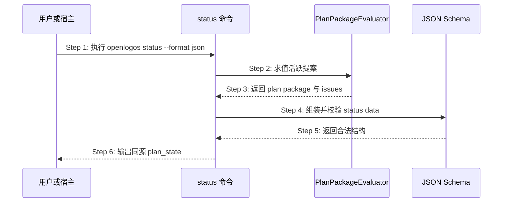

## ADDED — status 的统一 Plan Package 观测

### 主时序

### 步骤说明

1. **用户或宿主**请求状态快照。
2. **status**调用共享 evaluator，不复制 proposal/tasks 判据。
3. **evaluator**返回 proposal/tasks 三态、ready 与稳定问题。
4. **status**只做字段投影与模块挂载。
5. **JSON Schema**验证新增字段且保持旧字段兼容。
6. **status**输出与 change-lint/next/flow 同源的 plan_state。

### 异常与边界

#### EX-3.1：evaluation 非法
- **触发条件**：文件不可读或共享 evaluator 抛出操作错误。
- **期望响应**：status 输出 error envelope，不把错误吞成 `plan_ready=false` 成功态。
- **副作用**：无写入。

#### EX-6.1：历史提案已越过 plan
- **触发条件**：存在批准/合并/验收 marker 但旧模板不符合新规则。
- **期望响应**：保持真实前沿，可选 warning 不改变 plan_state。
- **副作用**：不回退、不改文件。

### 追溯

- 需求：四方一致、历史兼容与只读要求。
- 测试：UT-S11-58～UT-S11-62、ST-S11-36～ST-S11-37。
