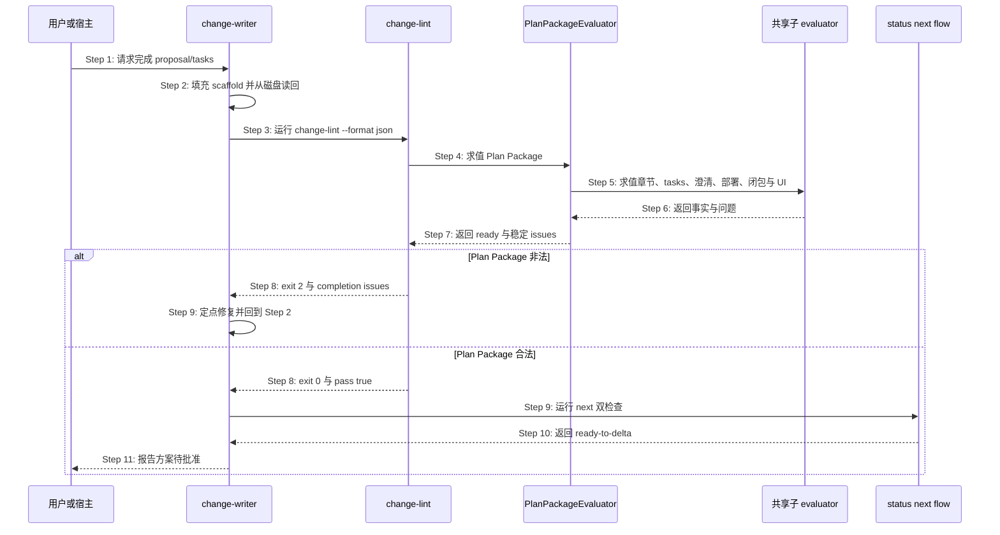

## ADDED — S35：提案计划产物左移硬检查（完整场景文档）

# S35：提案计划产物左移硬检查（change-lint）

> Feature：F04 变更提案与切片生命周期  
> 来源：需求 S35、功能规格 §2.30 与 §2.43、跨仓 Plan Package 修复方案

## 场景目标

在 proposal/tasks producer 向用户报告完成之前，由 OpenLogos CLI 独立证明 Plan Package 满足统一合同；失败时返回可供同一 Agent 定点修复的结构化问题，并保证 change-lint、status、next 与 flow derive 对同一输入收敛。

## 用户价值

用户只会在方案真正可批准时看到 `ready-to-delta`，不会遭遇“lint PASS 但面板仍 writing”，也无需理解 canonical 标题、模板占位或插件缓存漂移。

## 参与者

- **用户/宿主**：触发检查并消费最终完成结论。
- **change-writer**：生产 proposal/tasks、读回并消费问题修复。
- **change-lint**：命令入口、退出码与 envelope 所有者。
- **PlanPackageEvaluator**：唯一完成判据与 issue 生产者。
- **status/next/flow**：只读消费同一 evaluation 的投影方。
- **AssetManifest**：证明 producer Skill/模板与 CLI 合同一致。

## 前置条件

- 项目已初始化，guard 指向当前 launched change。
- proposal/tasks 已由 change-writer 填充但尚无 Delta、无 `PLAN_APPROVED`。
- 项目 locale、模块、部署决定、clarification 与 baseline closure 可读取。

## 成功后置条件

- `change-lint --format json` exit 0 且 `data.pass=true`、`data.plan_package.ready=true`。
- status 的 `plan_ready=true`，next 的 `proposal_step=ready-to-delta`，flow predicate 同样完成。
- 检查前后项目全量文件集合与内容 hash 不变。
- change-writer 才能向用户报告方案待批准；本场景不写审批 marker。

## 时序图

## 步骤说明

1. **用户或宿主**要求 change-writer 完成当前提案，而不是直接授权 Delta 或 merge。
2. **change-writer**保留 CLI canonical scaffold，只替换占位正文；落盘后重新读取真实字节。
3. **change-writer**从项目根运行带明确 slug 的 change-lint JSON 命令。
4. **change-lint**完成操作错误前置检查后调用唯一 **PlanPackageEvaluator** 作为 L0。
5. **PlanPackageEvaluator**调用 authority scan、tasks parser、clarification、deployment、baseline closure 与 UI 声明共享 evaluator。
6. **共享子 evaluator**返回结构化事实；不得自行写文件或吞掉解析错误。
7. **PlanPackageEvaluator**规范化、去重并稳定排序 issues，计算 proposal/tasks 三态与 ready。
8. **change-lint**在 ready=false 时 exit 2、ready=true 时继续 L1～L9 并最终 exit 0；操作错误仍 exit 1。
9. 失败时 **change-writer**只修 issues 指向的当前提案文件并读回重试；成功时运行 next 双检查。
10. **status/next/flow**消费同一 evaluation；next 必须进入 `ready-to-delta`，不得仍为 writing。
11. **change-writer**向用户报告最终收敛结果并等待 plan gate 批准，不自动产 Delta 或 marker。

## 异常与边界

### EX-5.1：canonical summary 缺失
- **触发条件**：proposal 把 locale summary 改为自由标题，或章节缺失/重复/为空。
- **期望响应**：`proposal_required_section_missing|duplicate|empty`，包含 path、section_id、expected 与 fix_hint。
- **副作用**：lint/status/next/flow 均只读，plan 不 ready。

### EX-5.2：plan 阶段 code 占位或切片
- **触发条件**：tasks 保留 `实现代码变更` 或提前出现任意 `[code]` checkbox。
- **期望响应**：模板残留或 `tasks_code_entry_before_spec_complete`；空 `[code]` 锚点本身合法。
- **副作用**：不 auto-reset；auto-reset 仍只属于既有 merge/slice 边界。

### EX-7.1：子 evaluator 操作错误
- **触发条件**：proposal/tasks 不可读、YAML parser 失败或项目根事实不可安全解析。
- **期望响应**：exit 1 error envelope；不得降级成 pass=false success envelope。
- **副作用**：后续检查停止，文件与 marker 不变。

### EX-9.1：Agent 自然语言声称完成
- **触发条件**：文件非法但 Agent 输出“已完成”。
- **期望响应**：机器门仍失败；宿主 completion barrier 不得把 WorkUnit 标成 completed。
- **副作用**：用户不看到“可写 Delta”。

### EX-10.1：历史提案已越过 plan
- **触发条件**：存在 `PLAN_APPROVED|SPEC_MERGED|MERGED|VERIFY_PASS` 且旧 scaffold 不符合新规则。
- **期望响应**：保持现有前沿，仅允许非阻塞 warning。
- **副作用**：不回退、不改写历史。

### EX-10.2：Skill/模板资产过期
- **触发条件**：项目 sync hash 与 CLI asset manifest 不一致。
- **期望响应**：只读状态可见；producer dispatch 提示 sync + 重开 session，禁止静默使用旧 Skill。
- **副作用**：不覆盖用户/项目自有 Skill。

## API、数据库与安全边界

- 所有交互是本地进程/文件合同，API、数据库与 API 编排为 SKIP。
- completion 命令保持只读，不写 `PLAN_APPROVED`、Delta、MERGE_PROMPT 或宿主 WorkUnit 状态。
- RunLogos 自动回传、三次修复预算和 UI 展示属于独立 companion change。

## 追溯

- 需求：S05/S08/S09/S11/S35 Plan Package 完成合同收敛需求。
- 功能规格：§2.43 Plan Package 统一完成合同。
- 架构：第三十三章 Plan Package 完成合同收敛架构。
- 方法论：`spec/change-management.md`、`spec/tasks-spec.md`、`spec/flow-spec.md`、`spec/cli-json-output.md`。
- 测试：UT-S35-100～UT-S35-111、ST-S35-16～ST-S35-18、SMOKE-core-135～SMOKE-core-140。
