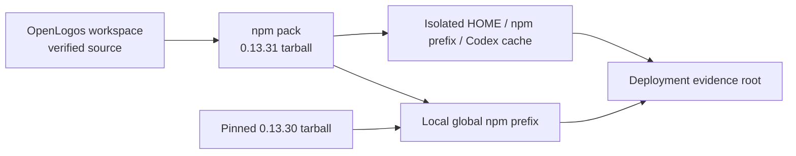

## ADDED — Plan Package 收敛修复 v0.13.31 本机全局部署方案

### 一、部署目标与授权边界

构建真实 `@miniidealab/openlogos@0.13.31` npm tarball，证明 CLI、proposal/tasks 模板、双语 change-writer、生成插件、JSON Schema 与 asset manifest 属于同一合同；verify 通过且用户另行授权后，部署到本机 npm 全局环境并保留 0.13.30 可恢复制品。

本方案不授权 smoke、npm publish、dist-tag、Git tag、GitHub Release、官网/Cloudflare 部署或 git push。RunLogos companion 不在本部署中安装或修改。

### 二、部署拓扑

### 三、前置条件与输入

- `openlogos verify` 已 PASS，全部目标测试由 OpenLogos reporter 形成可追溯结果。
- 工作区改动已由规格/代码提交边界隔离，不用脏工作树临时文件替代随包资产。
- 固定候选 tarball 绝对路径、大小、SHA-256；固定当前 0.13.30 tarball、SHA-256、全局 prefix、命令 realpath 与版本。
- 一次性 HOME、npm prefix、Codex cache、fixture workspace 和 evidence root 均由安全临时目录创建并逐一 realpath 校验。
- 不要求 registry、发布 token、Cloudflare/GitHub Secret 或 RunLogos 仓库写权限。

### 四、制品构建与身份核验

1. 在 `cli/` 执行全量测试与 build，再执行 `npm pack --json` 生成本地 tarball。
2. 校验 tarball 包名、version、bin 入口、文件清单、大小和 SHA-256。
3. 校验 CLI/package 与所有有版本字段的插件 manifest 精确为 0.13.31。
4. 解包检查 `openlogos/asset-manifest@1`：package version、Plan contract version、proposal/tasks 模板、`SKILL.md`、`SKILL.en.md` 与生成插件 hash 完整。
5. 重新计算每个资产 hash；任一缺失、重复、同 semver 不同字节或 plugin build diff 均在安装前失败。

### 五、隔离安装态验证

1. 将候选包安装到一次性 npm prefix，清除 shell command cache，并从新 shell 解析 `openlogos` realpath/version。
2. 在一次性中文与英文 launched fixture 分别执行 init/change，核对 canonical proposal summary 与空 `[code]` 锚点。
3. 写入合法/缺 summary/旧 code checkbox 三种 plan，分别运行 change-lint/status/next/flow fixture，验证四方一致和精确 issues。
4. 在一次性 Codex cache 安装候选插件，核对版本 + asset hash；同版本旧字节必须被识别而非复用。
5. 运行 sync 两次，验证 stamp 的 `planContractVersion/managedAssetsHash`、幂等、用户/项目自有 Skill 与未知资产字节不变；每次刷新后用新 session 读取。

### 六、本机全局部署与入口证明

仅在隔离验证全绿且用户明确授权部署后：

1. 安装固定 0.13.31 tarball 到已记录的本机全局 prefix。
2. 新 shell 核验命令 realpath、prefix、CLI/package/plugin versions 与 asset manifest hash。
3. 不在本仓活跃提案运行破坏性 merge fixture；只读 status/next 可运行，写路径使用一次性项目。
4. 生成 `logos/resources/verify/deployment-report.md`，记录命令、exit code、版本、realpath、tarball SHA、资产对账与公开副作用审计。

### 七、回滚与恢复

1. 在相同 prefix 实际安装固定 0.13.30 tarball，打开新 shell 核验版本与入口。
2. 用固定 0.13.31 tarball恢复，重新核验版本、入口与最小合法 Plan Package fixture。
3. 任一步失败立即恢复部署前快照；不得从网络临时下载未固定制品作为唯一回滚来源。
4. 恢复失败保留脱敏 evidence，提案保持未完成，不写 DEPLOY_DONE 或 SMOKE_PASS。

### 八、数据、密钥与清理策略

- 无数据库或业务数据迁移；sync stamp 是向后兼容新增字段。
- 不读取账号、token、真实 Codex 对话缓存或项目自有 Skill 内容；资产比较只保存路径、大小和 hash。
- 仅清理本次创建且 realpath 位于一次性根内的 fixture；真实全局 prefix 只通过 npm 安装/回滚管理，不递归删除。

### 九、部署后检查与 smoke 输入

- 全局制品与 asset manifest 身份：SMOKE-core-135。
- 中英文 scaffold 与 L0 精确 issues：SMOKE-core-136。
- change-lint/status/next/flow 四方一致与零写：SMOKE-core-137。
- sync stamp、用户资产、幂等与新 session：SMOKE-core-138。
- plugin/Codex cache 同版本漂移识别：SMOKE-core-139。
- `0.13.31 → 0.13.30 → 0.13.31` 回滚恢复与公开副作用为零：SMOKE-core-140。

### 十、门禁结论

部署需要：是；数据迁移：否；回滚：必须；部署后 smoke：必须且独立授权。任一制品、资产、四方一致性、隔离或回滚证据缺失均不得执行 `openlogos deploy-done`。
