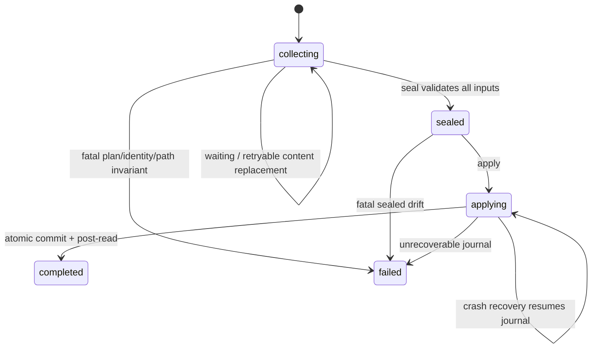

## ADDED — 三十四、合并事务单一权威架构

### 34.1 组件与所有权

```text
MergePlanBuilder (OpenLogos)
  ├─ canonical target/mode/source/before identity
  ├─ deterministic OpenLogos-produced metadata targets
  └─ canonical plan_hash / transaction_id / target_ref
            ↓
MergeTransactionStore
  ├─ MERGE_TRANSACTION.json（OpenLogos 原子写）
  ├─ merge-content/<transaction-id>/<target-id>.content（Agent 唯一写区）
  └─ private journal/staging/backup（OpenLogos 唯一写区）
            ↓ seal
MergeTransactionValidator
  ├─ slot/path/symlink/size/encoding/hash
  ├─ Markdown conservation + API/DB/schema validators
  └─ plan/target/source/before drift
            ↓ apply
BaselineClosureBatchApplier
  ├─ resources + metadata + prototype/dogfood
  ├─ test change set + completed receipt
  └─ SPEC_MERGED（最后写）
```

OpenLogos 是 plan、transaction、phase、error、正式字节、receipt 和 marker 的唯一 writer。Agent 对 transaction、正式目标和 marker 只读，只能原子替换声明的 content slot；RunLogos 只消费 CLI JSON 和 `allowed_actions/next_action`，不解析磁盘私有状态来重建权威。

### 34.2 身份与确定性

`plan_hash` 必须由稳定排序的 canonical change/module/targets/modes/source hashes/before hashes/producer/validator/contract version 经过唯一 canonical JSON 编码后计算；禁止纳入绝对路径、时间戳、进程 ID 或主机信息。`transaction_id` 与 opaque `target_ref/slot_id` 必须由冻结算法从 plan identity 派生，并用 golden fixture 锚定源码态与 tarball 安装态一致性。

相同输入重试得到相同计划身份；计划内容变化必须得到不同 `plan_hash`，不能在旧 transaction 上静默换目标。

### 34.3 状态机与动作权威



任何状态响应都携带 `allowed_actions` 和至多一个 `next_action`。内容缺失或 validator 失败不得进入 failed；fatal 不得被通用 deadline 覆盖。failed 与 completed 都是终态，重复读取必须返回同一身份和结果。

### 34.4 原子 slot 与 seal 边界

Agent 写 slot 时必须使用 transaction 声明的同目录临时路径与 rename 规则；OpenLogos 不读取半写文件。seal 在单一锁内检查缺失/多余/空/超限/symlink/逃逸/临时残留/编码/validator/hash，并冻结每个 slot 的 sealed hash。validator 失败保持 collecting，允许 Agent 替换目标 slot；seal 成功后 slot 不可变。

API/DB 等专用 validator 目标及 decision/counter/index/resource index、根 spec/skill dogfood、UI receipt 绑定、test change set、marker 由 OpenLogos 确定性生成，不经 Agent slot。

### 34.5 Apply、journal 与崩溃恢复

`applyBaselineClosureBatch()` 继续作为内部原子原语，但不再暴露外部 manifest owner。apply 先完成全批预演，再原子写 journal，随后 staging、backup 和 rename；正式提交顺序以 marker 最后写为硬约束。journal 至少冻结 transaction identity、目标 before/final hash、备份位置、提交进度和恢复策略。

启动 status/seal/apply 时先恢复未终结 journal：要么前滚到全部 final + completed receipt，要么回滚到全部 before；不得返回半新成功态。response lost 后重复 apply 必须通过 completed receipt 幂等返回，不得重新提交或产生第二个 marker。

### 34.6 no-delta、UI 与 metadata

- no-delta 创建零 Agent slot transaction，OpenLogos 直接 seal/apply并写同形 receipt；
- UI prototype 作为同批 OpenLogos target，或以不可变 UI commit receipt 绑定 `plan_hash`；
- scenario/decision counter、resource index、dogfood 与 test change set 均在同一批次计算并提交；
- `SPEC_MERGED` 只引用 completed transaction/receipt identity，不能独立 touch。

### 34.7 公共边界与实现映射

- 新增 `cli/src/lib/merge-transaction.ts`、`cli/src/commands/merge-transaction.ts` 与 receipt/contract-hash 唯一构造模块；
- `merge.ts` 只创建或读取 transaction，不直接形成第二条 no-delta/UI 成功链；
- `status.ts`、`next.ts`、flow derive/overlay/lifecycle 只投影公共状态；
- `i18n.ts` 生成的提示不再要求 Agent 写 manifest、正式目标或执行 Git；
- `merge-apply.ts` 的外部成功路径删除或固定非零退出，内部 batch applier 继续复用；
- package/prepack/postpack 必须把 schema、双语 Skill 与 golden 一起打入 `0.14.0` tarball。

### 34.8 架构不变量

1. 同一 merge change 只有一个 canonical plan、一个 transaction、一个最终 receipt。
2. 普通 Agent 对正式 target、metadata、transaction control、journal 和 marker 零写入。
3. status 只读，next/flow 不猜动作，RunLogos 不维护影子错误分类或 deadline 成功判定。
4. resources、metadata、dogfood、test change set 与 marker 全有或全无。
5. Plan Package completion 与 merge transaction 的 schema、identity、journal 和 dispatch 命名空间完全分离。
6. 本机全局 `0.14.0` tarball 与 RunLogos 真实 E2E 是架构交付门，不以源码 fixture 代替。
