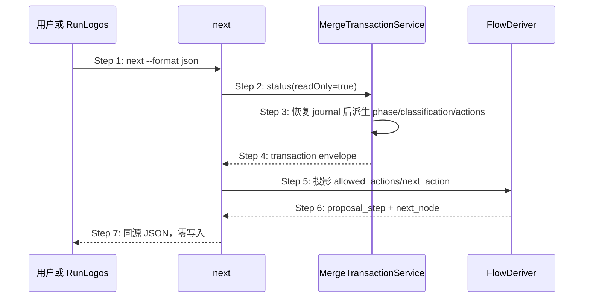

## ADDED — 合并事务动作权威的 next 时序

### 场景目标

让用户或 RunLogos 只根据 OpenLogos transaction 的 `allowed_actions/next_action` 获得下一步，避免根据文件存在、deadline 或私有状态机猜测 seal/apply/重试动作。

### 参与者与前置条件

- 用户或 RunLogos：请求 `openlogos next --format json`；
- next 命令：只读入口；
- MergeTransactionService：transaction 唯一状态与动作权威；
- Flow 派生：把公共动作投影成 `proposal_step/next_node`。

前置条件为活跃提案已通过 plan 门，且 OpenLogos 已创建或可确定性恢复同一 `plan_hash` 的 transaction。

### 成功后置条件

next 输出的 transaction identity、phase、classification、allowed actions 和 next node 同源；调用前后 transaction、content、resources 与 marker 字节不变。

### 主时序

### 步骤说明

1. 调用方请求 next 机器输出，不传入宿主自定义动作。
2. next 调用 transaction 的只读 status，不扫描 slot 推测完成。
3. service 先收敛可恢复 journal，再由权威状态机计算动作。
4. envelope 返回稳定 transaction/plan identity 与错误分类。
5. flow 只接受 envelope 声明的动作。
6. collecting/waiting 返回内容准备动作；retryable 返回替换指定 slot 后 seal；sealed 返回 apply；completed 返回进入切片/后续前沿；failed 返回诊断，不伪造可重试动作。
7. next 输出通过 schema 校验，且不写任何 marker。

### 异常与边界

#### EX-MT-05-1：内容缺失
- **触发条件**：必需 content slot 不存在。
- **期望响应**：`phase=collecting`、`classification=waiting`，动作只包含 status/受控内容准备，不进入 apply。
- **副作用**：无。

#### EX-MT-05-2：内容 validator 失败
- **触发条件**：slot 字节存在但语义 validator 失败。
- **期望响应**：保持 collecting/retryable，next 指向原子替换明确 slot 后重新 seal，不创建新 transaction。
- **副作用**：无正式写入。

#### EX-MT-05-3：fatal 或未知主版本
- **触发条件**：identity/plan/path 不变量失败，或消费者不认识 transaction 主版本。
- **期望响应**：failed/fatal 或保守升级诊断；不得由 deadline 覆盖，不得返回 apply。
- **副作用**：无。

#### EX-MT-05-4：Plan completion 命名空间串线
- **触发条件**：宿主尝试把 `next_node.dispatch.completion` 当成 merge transaction 动作。
- **期望响应**：拒绝或忽略该输入，只使用独立 transaction envelope。
- **副作用**：Plan Package 与 transaction 状态均不改变。

### 追溯

- 需求：合并事务单一权威验收条件 2、6、7。
- 功能规格：§2.44.2、§2.44.4、§2.44.6。
- 测试：UT-S05-35～UT-S05-42、ST-S05-16～ST-S05-19。
