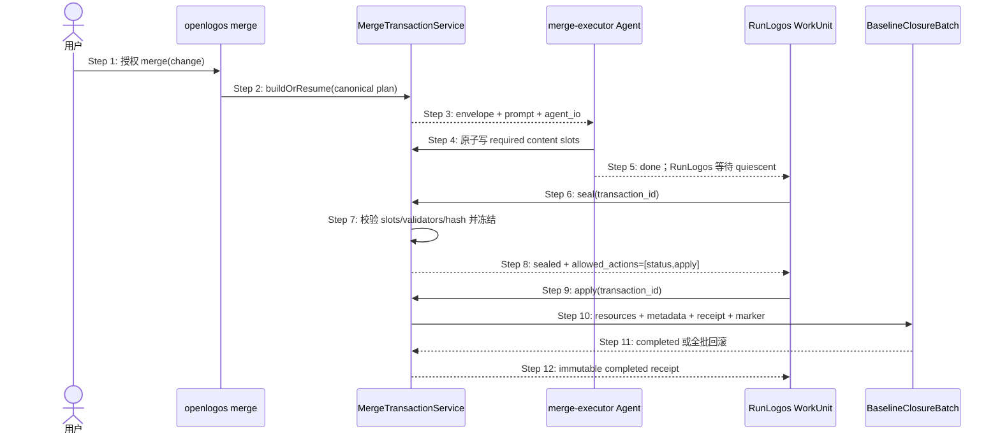

## ADDED — S09 合并事务单一权威生命周期

### 场景目标

把有 Delta、no-delta 与 UI prototype 提案的规格完成统一到一个 OpenLogos transaction，确保 Agent/RunLogos 不再生产外部 manifest 或直接写正式目标。

### 参与者

- 用户：批准 plan 与后续 merge 人类门；
- OpenLogos merge：创建或恢复 canonical transaction；
- merge-executor Agent：只写声明 content slots；
- OpenLogos seal/apply：校验、冻结并原子提交；
- RunLogos：消费公共动作并等待 WorkUnit quiescent。

### 前置条件

- plan 已批准，proposal/tasks/deltas 与 baseline closure 对账完成；
- guard、slug、module 匹配；
- 不存在同 change 的冲突 transaction 或不可恢复 journal。

### 成功后置条件

- transaction 为 completed，receipt、正式 targets、metadata 与 `SPEC_MERGED` 相互校验；
- `SPEC_MERGED` 绑定 transaction/plan/receipt hash；
- 后续 slice-planner 只读取已合并真实 UT/ST ID 与 completed receipt。

### 主时序

### 步骤说明

1. 用户授权 merge，不等于授权代码、部署或公开发布。
2. OpenLogos 用 proposal closure、tasks、deltas 和正式 before 字节计算唯一 plan；相同输入恢复同一 transaction。
3. Agent 只获得只读指令与明确 slot allowlist，不获得 canonical target/marker 写权限。
4. Agent 对 Markdown/普通规格生成最终原始字节并按原子替换协议写 slot；OpenLogos-produced targets 不分配 slot。
5. RunLogos 只把 WorkUnit 完成当作“内容生产停止”，不把它当作 merge 成功。
6. 仅在所有相关 WorkUnit quiescent 后调用 seal。
7. seal 先校验 slot 完整性，再执行类别 validator 与 sealed hash；失败不写正式目标。
8. sealed 后只允许 status/apply，slot 不可再替换。
9. RunLogos 按 `next_action=apply` 调用，不自建超时成功判断。
10. OpenLogos 通过 journal 执行全批原子提交，marker 最后写。
11. 任一失败恢复全部 before 或由同一 journal 前滚到全新。
12. completed receipt 是唯一成功证据；重复 apply 返回相同 receipt。

### no-delta 与 UI 分支

- no-delta：transaction 没有 Agent slot，OpenLogos 直接 seal/apply并生成同形 receipt；禁止旁路 touch `SPEC_MERGED`。
- UI prototype：原型作为 OpenLogos-produced target，或引用绑定同一 `plan_hash` 的不可变 UI receipt；hash 漂移在 apply 前拒绝。

### 异常与边界

#### EX-MT-09-1：Agent response lost
- **触发条件**：Agent 已原子写完 slot，但 done 响应丢失或 RunLogos 重启。
- **期望响应**：恢复同一 transaction，status 显示 collecting/sealable；不得清空已校验 slot或重建 target set。
- **副作用**：无正式写入。

#### EX-MT-09-2：seal validator 失败
- **触发条件**：某个 Markdown、schema、API/DB 或内容约束失败。
- **期望响应**：collecting/retryable，精确指向 slot/field；Agent 替换后可重试 seal。
- **副作用**：无正式写入、无 failed marker。

#### EX-MT-09-3：apply 崩溃
- **触发条件**：journal 落盘后、marker 前任一点中断。
- **期望响应**：下次 status/apply 先恢复为全旧或全新；永不暴露半新 completed。
- **副作用**：由 journal 可证明。

#### EX-MT-09-4：旧外部 manifest 调用
- **触发条件**：调用 `merge-apply --manifest` 或提供 `MERGE_APPLY_MANIFEST.json`。
- **期望响应**：固定非零升级提示，不执行任何正式写入，也不 fallback。
- **副作用**：无。

### 追溯

- 需求：合并事务单一权威验收条件 1～8。
- 功能规格：§2.44 全节。
- 测试：UT-S09-233～UT-S09-250、ST-S09-91～ST-S09-98。
