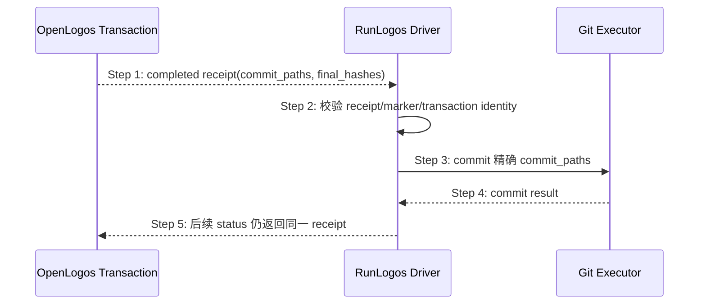

## ADDED — S09-B 合并事务责任、提交与授权边界

### 目标

把“内容准备”“正式规格提交”“Git commit”和“后续发布”拆成可审计的不同责任，消除旧流程中 Agent 同时生成 manifest、写正式目标、touch marker 和提交 Git 的越权链。

### 责任矩阵

| 责任 | 唯一所有者 | Agent / RunLogos 边界 |
|---|---|---|
| canonical target、mode、hash、producer/validator | OpenLogos | 只读，不得补全或重排 |
| transaction control、phase、journal、receipt | OpenLogos | 只通过 CLI 公共动作消费 |
| 声明的最终内容 slot | merge-executor Agent | 只写 `agent_io.write_paths`，原子替换 |
| metadata、counter/index、dogfood、marker | OpenLogos | Agent 与 RunLogos 零写入 |
| WorkUnit 完成与 quiescent | RunLogos | 只控制何时尝试 seal，不定义 merge 成功 |
| 规格 Git commit 路径 | completed receipt | RunLogos/AI 只能提交 receipt 的 `commit_paths` |

### 提交时序

### 步骤说明

1. 只有 OpenLogos completed receipt 能触发规格 commit；Agent done、WorkUnit done、`MERGE_PROMPT_GENERATED` 或 slot 齐全都不是成功证据。
2. RunLogos 校验 receipt schema/contract hash、transaction/plan identity、`SPEC_MERGED` hash 与每个 final hash。
3. Git 执行器只提交 receipt 精确列出的正式资源、metadata、dogfood 和 marker；transaction 私有 slot、临时文件、journal、staging、backup 不得进入 commit。
4. commit 失败不改变 transaction completed 状态；重试 Git 仍消费同一 receipt，不得重新 apply。
5. push、npm publish、tag、GitHub Release、官网发布仍是独立授权域；本机全局 candidate 安装不隐含这些授权。

### 异常与边界

#### EX-MT-09B-1：receipt 缺失或路径超集
- **触发条件**：transaction 非 completed，或 receipt `commit_paths` 包含 slot/journal/仓库外路径。
- **期望响应**：拒绝 commit，报告合同错误；不得扫描工作区猜路径。
- **副作用**：无 Git 写入。

#### EX-MT-09B-2：正式文件在 completed 后漂移
- **触发条件**：commit 前重算 final hash 与 receipt 不一致。
- **期望响应**：拒绝 commit并保留诊断；不得修改 receipt 或重跑 apply 覆盖用户字节。
- **副作用**：无 Git 写入。

#### EX-MT-09B-3：RunLogos deadline 到期
- **触发条件**：宿主 watchdog 到期但 OpenLogos 仍为 collecting/waiting 或 applying/recovering。
- **期望响应**：宿主继续按 allowed actions/status 处理或报告超时，不得自行标记 completed/failed。
- **副作用**：transaction 权威不变。

### 追溯

- 场景：S09 合并事务单一权威生命周期。
- 测试：UT-S09-245～UT-S09-250、ST-S09-96～ST-S09-98。
