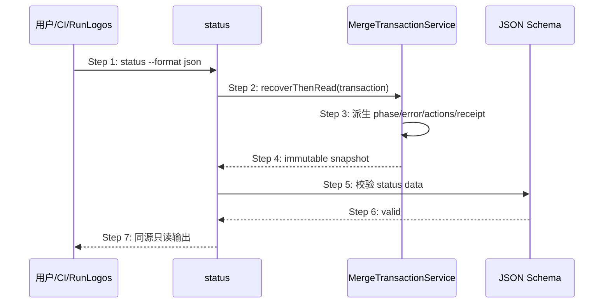

## ADDED — S11 合并事务只读状态投影

### 场景目标

让用户、CI 与 RunLogos 从 `openlogos status --format json` 读取唯一、稳定且零副作用的 merge transaction 进度，而不是扫描 slot、marker 或宿主内部 ledger 重建状态。

### 参与者与前置条件

- 调用方：用户、CI 或 RunLogos；
- status 命令：只读投影层；
- MergeTransactionService：状态、错误、动作与 receipt 权威；
- status schema：机器合同验证器。

前置条件为项目和 guard 可读；如存在未终结 transaction journal，service 必须先按锁顺序恢复到全旧或全新一致视图。

### 成功后置条件

status 输出包含同一 transaction 的 schema/contract hash、transaction/plan/change/module identity、phase、classification、code、allowed actions、next action、slot summary、receipt summary 与恢复诊断；调用前后项目树及 marker 集合 SHA-256 不变。

### 主时序

### 步骤说明

1. 调用方请求状态，不提供 phase 或动作覆盖值。
2. status 通过共享 service 读取，不直接解析 transaction 私有 JSON。
3. service 先处理可恢复 journal，再由状态机生成快照。
4. completed 返回不可变 receipt；failed 返回终态 fatal；collecting/sealed/applying 返回精确进度。
5. schema 同时约束枚举、required 字段与 unknown-major fail-closed。
6. 校验失败作为操作错误返回，不降级成看似正常的 writing/coding。
7. 输出与 next/flow 使用同一个快照，且零写入。

### 异常与边界

#### EX-MT-11-1：status 被调用多次
- **触发条件**：在任意 phase 连续调用 status。
- **期望响应**：若底层事实未变，响应的身份、phase、error 与 receipt 字节等价；不得刷新完成时间或写审计 marker。
- **副作用**：无。

#### EX-MT-11-2：journal 可恢复
- **触发条件**：上次 apply 在 response 前崩溃，存在合法未终结 journal。
- **期望响应**：在事务锁内前滚 completed 或回滚到 sealed/failed 的合同状态，再输出；不得展示半新 target 计数。
- **副作用**：仅允许 journal 规定的恢复写入，不产生第二个 transaction。

#### EX-MT-11-3：journal 不可恢复
- **触发条件**：备份、staging 或 identity 已损坏，无法证明全旧/全新。
- **期望响应**：failed/fatal + 稳定 code/field_path，allowed actions 仅保留 status/诊断；不得把 deadline 改写为普通超时。
- **副作用**：不继续写正式目标。

#### EX-MT-11-4：历史 completed receipt
- **触发条件**：重复 status 或宿主重启后读取 completed transaction。
- **期望响应**：返回同一 receipt 和 `commit_paths`，不从 Git 或正式文件重新构造另一份成功事实。
- **副作用**：无。

### 追溯

- 功能规格：§2.44.2、§2.44.5、§2.44.6。
- 测试：UT-S11-63～UT-S11-70、ST-S11-38～ST-S11-41。
