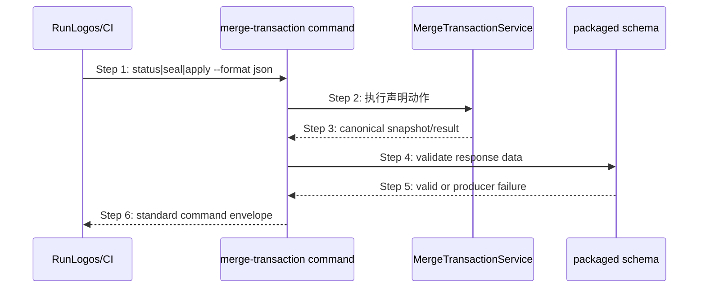

## ADDED — merge-transaction@1 机器输出时序

### 场景目标

让 CLI、RunLogos 和其它消费者通过同一版本化 JSON 合同读取 transaction 状态、可执行动作、错误与完成 receipt，不解析 Markdown、私有文件或 stderr 猜测流程。

### 公共 envelope

```json
{
  "schema": "openlogos/merge-transaction@1",
  "contract_version": "1",
  "contract_hash": "sha256:<frozen>",
  "transaction_id": "<opaque>",
  "plan_hash": "sha256:<canonical-plan>",
  "slug": "change-slug",
  "module": "core",
  "phase": "collecting",
  "classification": "waiting",
  "code": "merge-content-pending",
  "allowed_actions": ["status", "seal"],
  "next_action": "seal",
  "agent_io": {
    "read_paths": ["logos/changes/<slug>/MERGE_PROMPT.md"],
    "write_paths": ["logos/changes/<slug>/merge-content/<transaction-id>/<target-id>.content"],
    "slots": []
  },
  "receipt": null,
  "error": null
}
```

字段存在性随 phase 受 schema 约束：collecting 可有 `agent_io`；completed 必须有 receipt 且 classification/code/error 为空；failed 必须有 fatal error 且 next_action 不得声称同 transaction 可恢复内容。

### 主时序



### 步骤说明

1. 消费方只提交 command action、slug/module/transaction identity，不提交 phase 或 target list。
2. CLI 先检查 action 是否属于当前 `allowed_actions`，再调用 service。
3. service 返回唯一数据模型；text 输出也只能由该模型投影。
4. CLI 使用 tarball 内同版本 schema 校验生产者自身输出。
5. schema/hash 不匹配阻止 candidate 发布，不运行时静默降级。
6. RunLogos 只消费 data 字段，原样保留稳定 error code/stage/field_path。

### 错误结构

错误对象精确表达 `classification=waiting|retryable|fatal`、稳定 `code`、`stage=plan|collect|seal|apply|recover`、可空 `field_path`、脱敏 `detail`、`next_safe_action`、`retryable` 与 transaction identity。JSON 与 text 投影不得改写分类或丢失原始 code。

### Receipt 摘要

completed receipt 至少包含：transaction/plan/change/module identity、contract hash、phase、created/modified/changed paths、final hashes、metadata/test-change-set/marker identity、精确 `commit_paths` 和完成时间。数组稳定排序，hash 使用小写十六进制 SHA-256；相同 completed transaction 重复读取字节稳定，时间戳不重新生成。

### 异常与边界

#### EX-MT-16-1：未知 transaction 主版本
- **触发条件**：消费者不认识 schema 主版本。
- **期望响应**：消费者保守阻塞并提示升级，不得按字段猜测 seal/apply。
- **副作用**：无。

#### EX-MT-16-2：生产者输出不符合随包 schema
- **触发条件**：CLI 生成了非法 enum、缺 required 字段或 contract hash 与随包 schema 不符。
- **期望响应**：命令非零、候选构建/测试失败；不得输出 `success:true`。
- **副作用**：seal 前零正式写入；apply 中按 journal 恢复。

#### EX-MT-16-3：text/JSON 分类漂移
- **触发条件**：同一底层错误在 text 与 JSON 映射成不同 classification/code。
- **期望响应**：golden 合同测试失败；RunLogos 只信 JSON，不用 stderr 修补。
- **副作用**：无。

### 追溯

- 功能规格：§2.44.2～§2.44.5。
- Schema：`spec/schema/merge-transaction.schema.json`、next/status schema。
- 测试：UT-S16-18～UT-S16-27、ST-S16-05～ST-S16-08。
