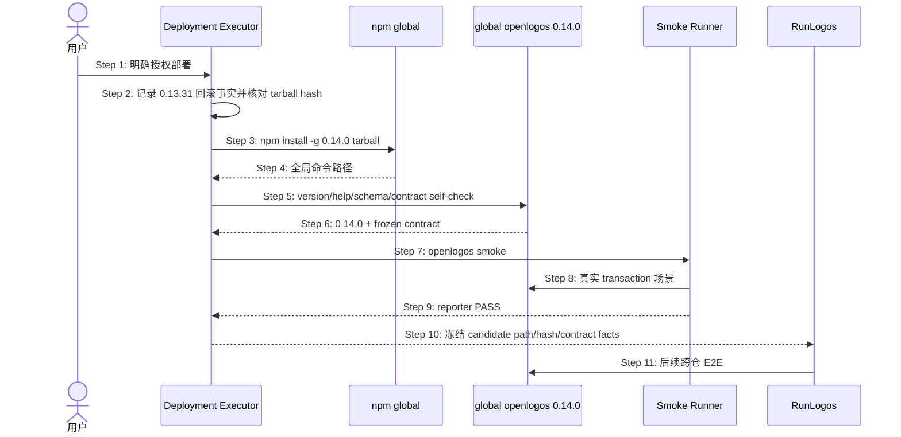

## ADDED — OpenLogos 0.14.0 全局 candidate 与 RunLogos 后验门

### 场景目标

在 verify 通过后，用真实打包并安装到本机全局的 OpenLogos `0.14.0` 验证 transaction 合同，再把同一 candidate 交给 RunLogos 做跨仓 E2E；源码态或 mock 不能冒充部署后 smoke。

### 参与者与前置条件

- 部署执行者：按已授权部署方案构建/安装/回滚；
- 全局 OpenLogos：实际被 shell 解析的 candidate；
- OpenLogos smoke runner/reporter：逐 ID 记录安装态结果；
- RunLogos：后续真实跨仓消费者。

前置条件：`VERIFY_PASS` 有效、部署任务获得明确授权、0.13.31 命令路径/版本/安装来源和回滚命令已记录、0.14.0 tarball 与 SHA-256 已冻结。

### 成功后置条件

- 新 shell 的 `command -v openlogos` 指向目标全局安装，`openlogos --version` 精确为 `0.14.0`；
- 随包 merge transaction schema、双语 merge-executor Skill、contract hash/golden 与源码候选一致；
- 安装态 smoke 全部 PASS 并产生 OpenLogos reporter 结果；
- RunLogos 可只通过全局命令路径调用同一 candidate；
- 失败时可恢复 0.13.31 且不留下错误版本或半安装状态。

### 主时序

### 步骤说明

1. 部署是独立人类确认点；plan 批准和 verify 不自动授权部署。
2. 在覆盖全局命令前保存可复制回滚事实，不能只记录版本字符串。
3. 安装真实 `npm pack` tarball，不用仓库内 `node dist` 或 symlink 冒充。
4. 在新 shell 解析命令，排除 shell hash/cache 指向旧版本。
5. 验证版本、命令面、随包 schema/Skill 与 contract hash。
6. 任一不一致立即失败，不进入 RunLogos。
7. smoke 只在 DEPLOY_DONE 与部署任务完成后执行。
8. runner 覆盖 CREATE、MODIFY、mixed、no-delta、validator retry、status 只读、崩溃恢复和 response-lost。
9. 每个 SMOKE ID 写真实 reporter 结果，不以手工结论替代。
10. 冻结绝对命令路径、tarball SHA-256、schema hash 和 contract hash供 RunLogos 使用。
11. RunLogos 不得改用源码路径或 mock。

### 异常与边界

#### EX-MT-19-1：全局版本或路径不符
- **触发条件**：命令仍指向旧安装、版本不是 0.14.0 或 tarball hash 不匹配。
- **期望响应**：部署/smoke 失败，不向 RunLogos声明 candidate ready；按方案回滚。
- **副作用**：记录诊断与回滚结果。

#### EX-MT-19-2：随包合同漂移
- **触发条件**：schema/Skill/contract hash 与源码冻结值不同或 `merge-transaction --help` 缺失。
- **期望响应**：candidate 无效，禁止 RunLogos 接入。
- **副作用**：恢复 0.13.31 或保留隔离诊断环境。

#### EX-MT-19-3：RunLogos 绕过 candidate
- **触发条件**：下游使用源码相对路径、mock、预造 receipt 或手工 target。
- **期望响应**：跨仓验收无效，不能进入完成/归档判定。
- **副作用**：OpenLogos 已完成 smoke 事实不被篡改。

#### EX-MT-19-4：出现公开发布命令
- **触发条件**：部署调用图包含 npm publish、tag、release、官网部署或 push。
- **期望响应**：立即阻断；本机全局部署授权不扩张为公开发布授权。
- **副作用**：不得执行公开命令。

### 追溯

- 部署方案：0.14.0 本机全局 candidate。
- 测试：UT-S19-12～UT-S19-18、ST-S19-10～ST-S19-13、SMOKE-core-141～SMOKE-core-150。
