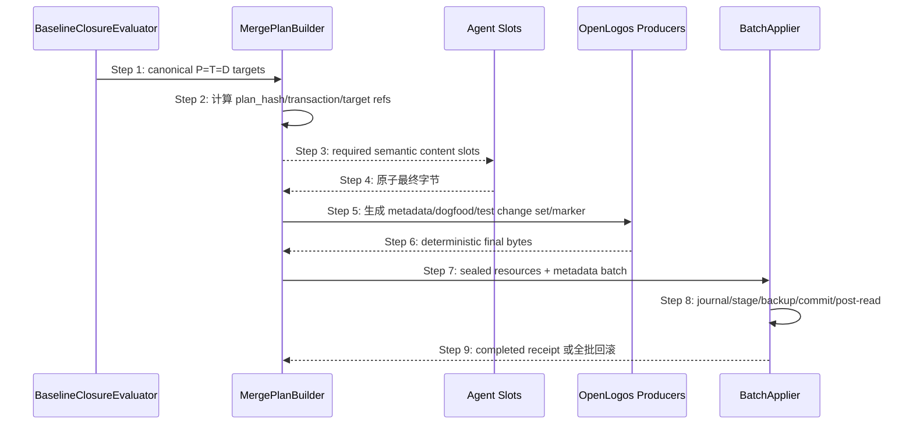

## ADDED — S39 canonical closure 进入单一 merge transaction

### 场景目标

把 baseline-on-touch 的全部物质目标和确定性 metadata 绑定到同一 transaction，避免 Agent manifest、decision/counter/index 专用事务、UI 专用事务和 no-delta marker 各自形成成功身份。

### 参与者

- BaselineClosureEvaluator：输出 P=T=D 的 canonical target 计划；
- MergePlanBuilder：将 closure 变为 transaction targets/producer/validator；
- Agent：只生产需要人类语义合并的 content slots；
- OpenLogos producers：生成 metadata、decision/counter/index、dogfood、test change set 与 marker；
- BaselineClosureBatchApplier：同批提交并恢复。

### 前置条件

- 当前 change 的 `baseline_closure` 合法、无 AMBIGUOUS，P=T=D；
- seed journal 已恢复，正式 resources/index/counter 是全旧或全新一致视图；
- target 的 MODIFY/CREATE 磁盘事实、source hash 与 before hash 已冻结。

### 成功后置条件

- receipt 的 target/metadata summaries 与 proposal closure 一一对应；
- 正式 resources、decision、counter、resource index、dogfood、test change set 与 `SPEC_MERGED` 全有或全无；
- no-delta、UI prototype 和普通 closure 使用相同 transaction/receipt 成功语义。

### 主时序

### 步骤说明

1. evaluator 先按 canonical merge target path 对账，不以数量或 tasks/delta 反推 proposal。
2. plan builder稳定排序所有 targets，记录 mode、source/before identity、producer 与 validator。
3. 只有需要 Agent 判断合并正文的目标分配 slot；opaque target ref 不赋予正式路径写权限。
4. Agent 使用原始最终字节与原子 rename，不能提交 Base64 或 metadata。
5. OpenLogos 在 seal/apply 安全时点分配 decision DXX、推进 counter/index、同步根 spec/skill dogfood，并从 test before/final 计算 test change set。
6. 确定性 producer 输出纳入 sealed hash 和 receipt，不另建成功 marker。
7. apply inputs 同时包含所有 resources、metadata、prototype/dogfood 与最终 marker。
8. 任一 validator/rename/post-read 失败按 journal 恢复全部目标。
9. completed receipt 精确证明 target 集合、最终 hash 和 marker identity。

### 特殊分支

- `CREATE`：目标不存在事实在 plan 与 apply 前均检查；提交失败删除本批新建文件。
- `MODIFY`：before hash 漂移即 fatal plan drift，不用新字节静默重算。
- `no-delta`：P/T/D 物质集合为空，仍创建零 slot transaction；metadata/marker 由 OpenLogos 生成。
- `UI prototype`：使用同批 target 或绑定 plan hash 的不可变 UI receipt，不能在 transaction 外写正式原型。
- `decision D07`：最终取号、文件名/标题、counter 与 resource index 在同批生产，不能由 Agent猜号后散写。

### 异常与边界

#### EX-MT-39-1：额外或重复 target
- **触发条件**：slot、producer 或 apply batch 含 proposal closure 之外 target，或同 canonical path 重复。
- **期望响应**：seal 前 fatal 拒绝；无正式写入。
- **副作用**：transaction 保留诊断，不自动扩 scope。

#### EX-MT-39-2：metadata producer 失败
- **触发条件**：decision 分配、counter/index、dogfood 或 test change set 无法确定性生成。
- **期望响应**：seal/apply 失败；不得要求 Agent补 metadata bytes。
- **副作用**：全批保持 before。

#### EX-MT-39-3：marker 后置复核失败
- **触发条件**：写入后任一 final hash、counter/index 或 marker/receipt identity 不一致。
- **期望响应**：按 journal 回滚，包括删除本批 CREATE 和 marker；不得报告 completed。
- **副作用**：可重试时沿用同一 transaction journal。

### 追溯

- 规范：`spec/baseline-closure.md`、`spec/change-management.md`。
- 测试：UT-S39-39～UT-S39-50、ST-S39-20～ST-S39-25。
