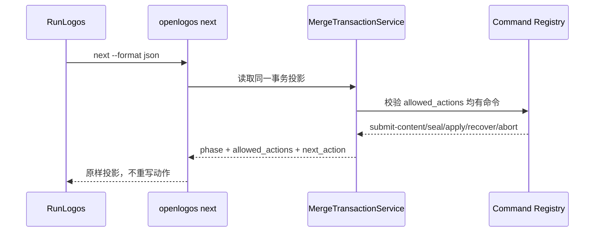

## ADDED — S05 消费者动作与命令对称补充

### 目标

next 只投影 OpenLogos 已注册且可执行的 merge transaction 动作，不允许宿主从 phase 猜测命令。

### 主路径

### 规则与异常

- collecting 可为 submit_content/abort，ready 和 sealed 可为 seal|apply/abort。
- failed/aborted、completed 均无下一动作；普通 fatal failed 也无动作。
- recovery_required failed 只允许 recover。
- action 无注册命令、next_action 不属于 allowed_actions 或出现未知 action 时返回 contract-invalid，Agent、quota、正式写入均为零。
- Plan completion 的 dispatch/completion 不能映射为 merge transaction action。
