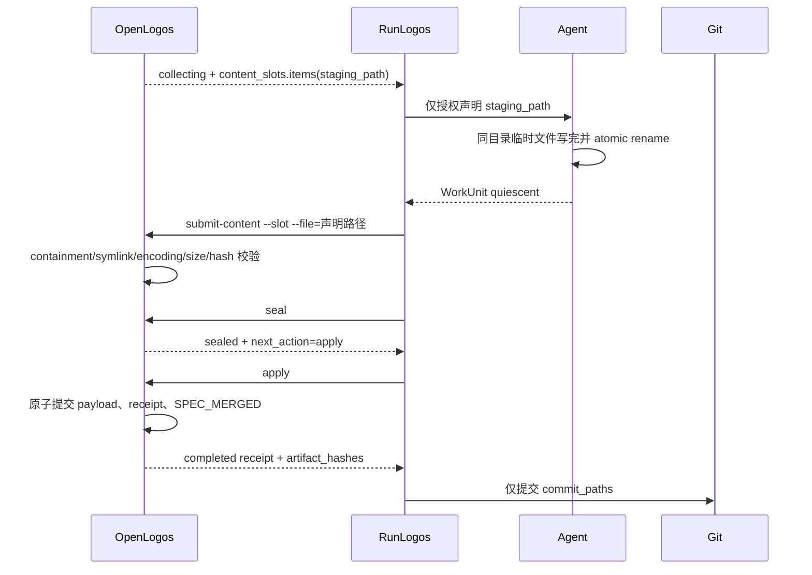
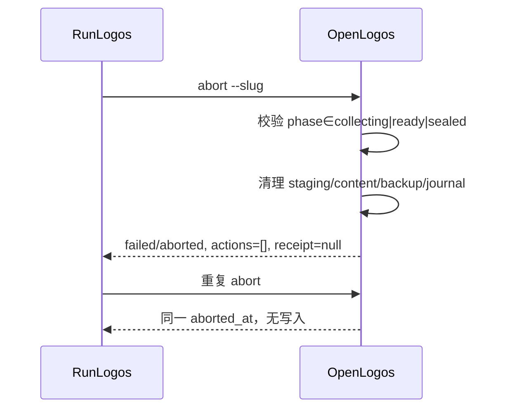

## ADDED — S09 公共 staging、abort 与 completed receipt 时序补充

### 主路径：声明 staging 到 completed

### Abort 分支

### Response-lost 与异常

apply 响应丢失后先 status/recover；completed 必须返回同一 receipt payload identity，并从持久化 receipt/marker 字节重建相同 artifact_hashes。file 参数不是声明 staging path、staging 漂移或 union(commit hash paths) 不等于 commit_paths 时，事务不进入 completed。
