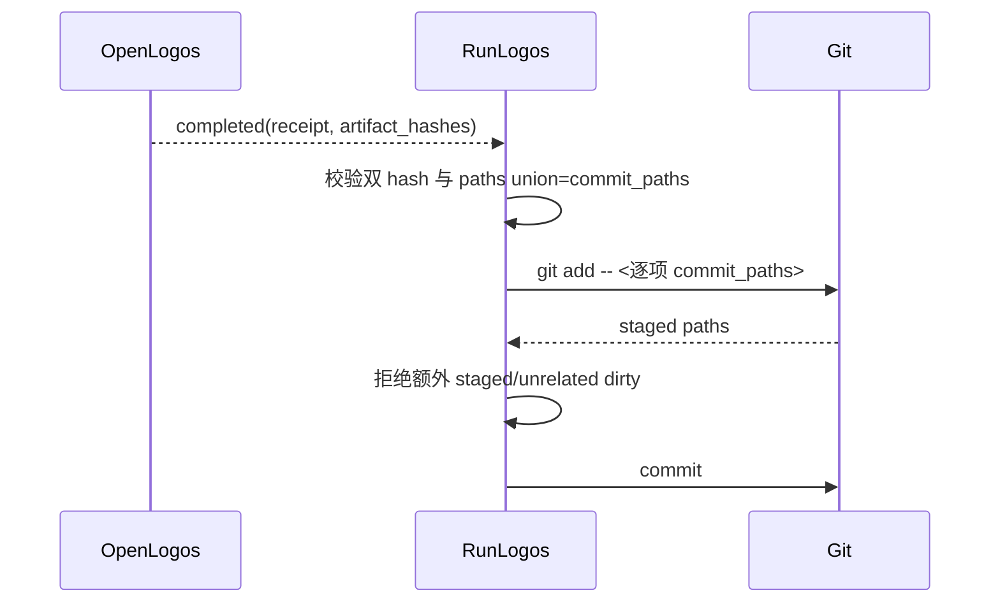

## ADDED — S09 精确 Git 提交与 stacked change 交接

### 精确提交主路径

RunLogos 不读取内部 receipt、slot、journal 或目录扫描来扩充提交集合。任何 commit path 缺 hash、额外 hash、重复路径、绝对路径或逃逸都 fail closed。

### Stacked change/guard 交接

1. 旧 `refresh-merge-transaction-cross-repo-plan` 只占用主 worktree 与 SMOKE-core-150。
2. 新 follow-up 只占用独立 branch/worktree 与 SMOKE-core-151+。
3. 新 candidate 部署后完成 RunLogos E2E；先让旧 smoke PASS 并归档旧 slug。
4. 再让 follow-up smoke PASS 并归档新 slug。
5. 两个 archive commit 完成且主 worktree 干净后合入 follow-up branch，冲突按 completed receipts 和有效规格解决并复验。
6. 禁止复制、删除、手改 guard，禁止跨 slug 共享 verify/smoke/archive marker。
