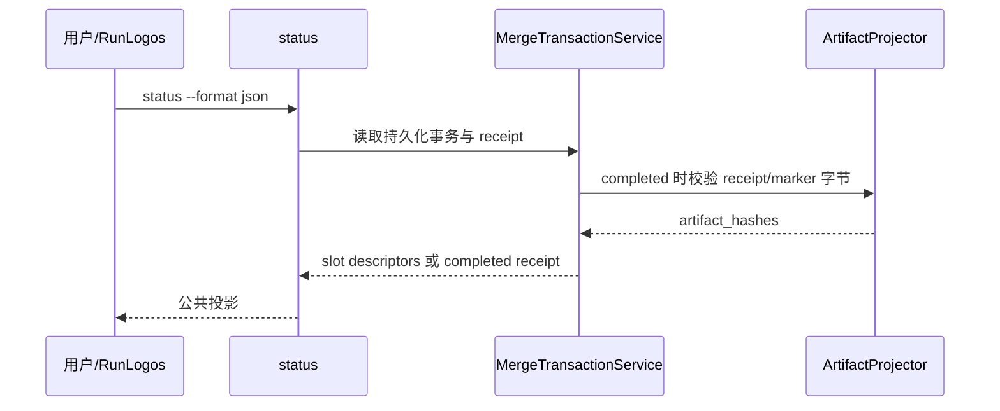

## ADDED — S11 完整消费者投影与真只读保证

### 主路径

### 投影规则

- collecting/ready/sealed：content_slots.items 公开 descriptor，不公开内容；receipt=null、artifact_hashes=[]。
- completed：receipt 含 payload closure/commit_paths；外层 artifact_hashes 覆盖 receipt/marker。
- failed/aborted：classification=aborted、actions=[]、receipt=null、aborted_at 稳定。
- recovery_required：只公开 recover，不伪装 aborted/completed。
- status 前后 transaction、staging、journal、marker、时间戳和项目树字节不变；外层 hash 只读重算必须等于首次 completed 投影。
