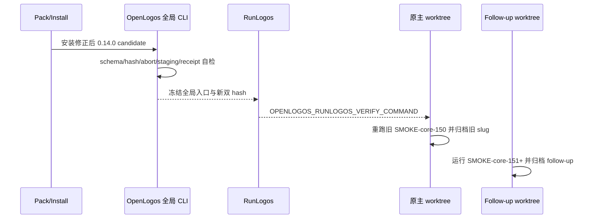

## ADDED — S19 修正 candidate 与双 slug smoke 交接

### 主路径

### 门禁

- 旧 candidate tarball/schema/contract hash 必须显式标为失效。
- 新 candidate 必须从真实 npm tarball 安装，不得用源码入口、workspace link 或 mock。
- SMOKE-core-150 仍只属于旧 slug；新 smoke ID 不覆盖或伪造其结果。
- 两个 worktree 分别维护自己的 VERIFY/DEPLOY/SMOKE marker 和报告。
- RunLogos 命令必须覆盖声明 staging、abort、completed commit_paths/final/artifact hashes 和 response-lost。
- 任一失败保留对应 slug 的 SMOKE_FAIL，不得借另一 worktree 的 PASS 归档。
