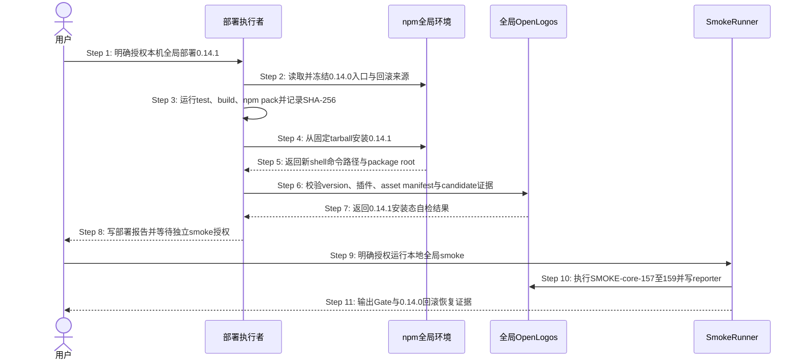

## ADDED — S19 0.14.1 本地全局 patch 候选分支

### 场景目标

在不触发公开发布的前提下，把已通过 verify 的仓库当前实现打成真实 0.14.1 npm tarball、安装到本机全局入口，并在部署后用同一制品执行最小 smoke；任一阶段失败都能恢复到冻结的 0.14.0，而不会留下混合版本或伪造成功证据。

### 参与者

- **用户（U）**：分别授权本地全局部署与部署后 smoke。
- **部署执行者（D）**：冻结旧版本事实、构建制品、安装、自检、回滚并生成部署报告。
- **npm 全局环境（N）**：承载实际 shell 命令入口和全局 package root。
- **全局 OpenLogos（O）**：从真实安装包运行版本、资产和 merge transaction 合同检查。
- **Smoke Runner（S）**：执行 SMOKE-core-157～159 并通过 reporter 写入真实结果。

### 前置条件

- 活跃提案为 `release-0-14-1-local`，规格与实现已完成，`VERIFY_PASS` 有效。
- 用户已明确授权部署到本机 npm 全局环境，但未授权任何公开发布动作。
- 当前全局命令为 0.14.0，命令路径、realpath、npm prefix、package root 和可复制回滚来源可读取。
- 0.14.1 package/candidate identity 已同步，CLI 全量测试与构建通过。

### 成功后置条件

- 新 shell 解析的全局命令、package、五类插件 manifest、asset manifest 和 candidate 证据均精确为 0.14.1，并绑定同一 tarball SHA-256。
- 部署报告记录部署前 0.14.0、0.14.1 candidate、安装命令、自检、回滚点与未解决风险。
- 获得独立 smoke 授权后，SMOKE-core-157～159 全部真实 PASS，结果归属于同一 candidate；公开发布副作用为零。
- 任一步失败时全局入口恢复为冻结的 0.14.0，或显式停在恢复失败状态且不写 `DEPLOY_DONE` / `SMOKE_PASS`。

### 主时序

### 步骤说明

1. **用户**只授权把当前仓库 candidate 部署到本机 npm 全局环境；授权不包含 publish、tag、release、官网部署或 push。
2. **部署执行者**在覆盖入口前读取全局 0.14.0 的命令路径、realpath、npm prefix 和 package root，并从当前已安装包生成或确认固定的本地回滚 tarball。
3. **部署执行者**依次执行 CLI 全量测试、TypeScript 构建和真实 `npm pack`，从 pack JSON 与解包字节核验包名、0.14.1 版本、bin、五类插件、asset manifest、文件数、大小和 SHA-256。身份不符时进入 EX-3.2。
4. **部署执行者**只从已冻结的 0.14.1 tarball 绝对路径执行全局安装，不使用 workspace link 或仓库源码入口。
5. **npm 全局环境**在新 shell 中返回重新解析后的命令路径与 package root；若入口仍指向旧缓存、link 或 prefix 外路径，进入 EX-5.1。
6. **部署执行者**调用全局 OpenLogos 校验 `--version`、package/plugin/asset manifest、schema/contract hash 与 candidate 证据；任一混合版本或旧证据进入 EX-6.1。
7. **全局 OpenLogos**返回与同一 0.14.1 tarball SHA-256 绑定的安装态事实。
8. **部署执行者**生成部署报告；自检全部通过才允许调用 `openlogos deploy-done --env local-global`，随后停在独立 smoke 授权点。
9. **用户**另行明确授权运行部署后 smoke；plan 批准、verify 或部署授权均不能替代本步骤。
10. **Smoke Runner**通过统一 dispatcher 调用已安装的绝对全局入口，执行 SMOKE-core-157～159，并逐 ID 写入 `smoke-results.jsonl`。任一结果或归属异常进入 EX-10.1。
11. **Smoke Runner**向用户输出 Gate；回滚演练必须完成 `0.14.1 → 0.14.0 → 0.14.1` 并验证每一步入口、版本与 SHA，最终保持 0.14.1。

### 异常与边界

#### EX-3.2：0.14.1 tarball 身份不一致

- **触发条件**：Step 3 的 package version、文件名、bin、插件/asset manifest、解包清单或 SHA-256 任一不一致。
- **期望响应**：停止安装并报告精确漂移项；不修改本机全局环境，不写部署成功标记。
- **副作用**：仅保留本次打包产物与诊断，当前全局 0.14.0 不变。

#### EX-5.1：全局入口未切换到目标制品

- **触发条件**：Step 5 的新 shell 仍解析到旧 cache、workspace link、仓库源码入口或目标 npm prefix 之外的命令。
- **期望响应**：判定部署失败，清理 shell cache 后重查；仍不一致则使用冻结制品恢复 0.14.0。
- **副作用**：不得继续 smoke，不写 `DEPLOY_DONE`。

#### EX-6.1：安装态资产或 candidate 证据漂移

- **触发条件**：Step 6 发现 package、任一插件、asset manifest、schema/contract hash 或 candidate version 混用 0.14.0/0.14.1，或证据缺字段、hash 不同源。
- **期望响应**：fail-closed，恢复冻结的 0.14.0 并验证入口/版本；恢复失败时显式阻塞。
- **副作用**：保留脱敏诊断，不写部署或 smoke 成功标记。

#### EX-10.1：smoke 结果不完整或副作用越界

- **触发条件**：Step 10 任一 SMOKE-core-157～159 缺失、skip、fail、重复矛盾、candidate 归属漂移，或调用图出现公开发布动作。
- **期望响应**：Smoke Gate FAIL，写失败报告但不写 `SMOKE_PASS`；必要时恢复 0.14.0。
- **副作用**：禁止 npm publish、dist-tag、Git tag、GitHub Release、官网/Cloudflare 部署与 git push。

### 派生边界与追溯

- API/RPC/消息边界：无；全部交互为本机 CLI 子进程、npm package 与文件证据。
- 持久化边界：只写 npm 全局 package、提案部署报告、`DEPLOY_DONE`（通过受控命令）和 smoke JSONL/报告；无数据库。
- 需求：S19-AC-01～S19-AC-04。
- 测试：UT-S19-22、UT-S19-23、ST-S19-15、SMOKE-core-157～SMOKE-core-159。
