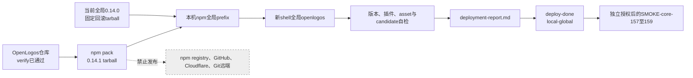

## ADDED — OpenLogos 0.14.1 本机全局 patch candidate 部署方案

### 部署目标与授权边界

- 部署对象：当前仓库构建的真实 `@miniidealab/openlogos@0.14.1` npm tarball。
- 目标环境：本机 npm 全局 prefix；计划阶段已观测为 `/opt/homebrew`，执行时必须重新读取，不把历史值当作实时事实。
- 当前回滚基线：本机全局 `openlogos` 0.14.0；执行时冻结命令路径、realpath、package root、安装来源和本地回滚 tarball SHA-256。
- 前置门禁：规格已合并、实现切片全部完成、OpenLogos reporter 完整、`openlogos verify` 为 PASS，且用户明确授权本地全局部署。
- 本地部署授权不包含 npm publish、dist-tag、Git tag、GitHub Release、官网/Cloudflare 部署或 git push；调用图出现任一此类动作即失败。
- smoke 是部署后的独立确认点；部署完成只允许执行受控 `openlogos deploy-done --env local-global`，不得自动运行 smoke。

### 部署拓扑

### 环境、凭据与数据边界

- 需要本机 Node.js 18+、npm、可写的当前 npm 全局 prefix，以及创建隔离临时目录的权限。
- 不需要 `NPM_TOKEN`、GitHub token、Cloudflare token、生产凭据、域名或远程服务账号；发现部署命令要求这些凭据时停止。
- 无业务数据库、schema 或用户数据迁移。npm 全局 package 是唯一运行环境变更；测试 fixture、证据与回滚包放在 realpath 已验证的一次性或提案局部路径。
- 不读取或修改其它用户项目、真实 HOME 下未知配置、未知 owner 插件或 npm prefix 之外的文件。

### 部署前事实冻结

执行者在任何全局安装前完成并记录：

1. `command -v openlogos`、可执行文件 realpath、`openlogos --version`、`npm prefix -g` 与 `npm root -g`。
2. 从全局 package root 读取 package、五类插件 manifest 与 asset manifest，确认当前状态精确为 0.14.0 且不是 workspace link。
3. 从当前已安装 0.14.0 package root 生成本地回滚 tarball，或选择已有固定 tarball；核验包名、版本、bin、文件清单与 SHA-256，并实际在隔离 prefix 试装/执行 `--version`。
4. 形成可复制回滚命令：从该绝对 tarball 路径重新全局安装，启动新 shell，复核入口、realpath、版本和 package/plugin/asset identity。
5. 若无法得到可验证的 0.14.0 回滚制品，停止部署；不得把未固定的 registry 下载当作唯一恢复方案。

### 0.14.1 构建与制品证明

未来获得部署执行授权后，在项目根按以下等价步骤执行；本 Delta 阶段不运行命令：

1. `cd cli && npm test`：全量 UT/ST 与 OpenLogos reporter 必须通过，覆盖 UT-S19-22、UT-S19-23、ST-S19-15。
2. `cd cli && npm run build`：TypeScript 构建通过，`dist/index.js` 存在且 bin 可执行。
3. `cd cli && npm pack --json`：生成真实 0.14.1 `.tgz`；prepack 重新生成 asset manifest 并打入当前 skills、spec 与五类插件模板。
4. 解析 pack JSON 与 tarball，记录绝对路径、package name、version、bin、文件数、压缩/解压大小和 SHA-256。
5. 解包重算 package、Claude/Codex/ZCode/Qoder/WorkBuddy manifest 和 asset manifest：当前 identity 均为 0.14.1，manifest 文件 hash 与 tarball 字节一致。
6. 在隔离 prefix 先执行 ST-S19-15；真实完成 `0.14.1 → 0.14.0 → 0.14.1`，每一步新 shell 入口、版本、package root 和制品 SHA 都一致，失败注入可恢复。

任一 test、build、pack、清单、版本、hash、隔离安装或回滚检查失败即停止，不触碰本机真实全局安装。

### 本机全局安装与自检

1. 只对已冻结 SHA-256 的 0.14.1 tarball 绝对路径执行 `npm install -g <tarball>`；禁止 `npm link`、相对 workspace 安装、仓库 `node dist` 或公开 registry 包替代。
2. 清除当前 shell 命令 hash，启动新 shell，重新读取 `command -v openlogos` 与 realpath；二者必须位于执行时读取的 npm 全局 prefix/bin。
3. 执行 `openlogos --version`，必须精确输出 0.14.1；读取全局 package、五类插件和 asset manifest，版本必须全部为 0.14.1。
4. 从全局 package 重算 merge transaction schema/contract、双语 Skill 和 asset hash，并与部署前冻结的源码/tarball 事实对账。
5. 运行不改用户工作区的最小命令面检查和 candidate evidence validator；0.14.0 旧 facts、混合版本或缺字段必须稳定拒绝。
6. 全部通过后写 `logos/resources/verify/deployment-report.md`，记录时间、环境 `local-global`、命令摘要、制品 SHA、安装前后入口/版本、回滚点、数据迁移“无”、公开副作用“零”和未解决风险。
7. 报告完整且 `[deploy]` 任务全部完成后，执行 `openlogos deploy-done --env local-global`；随后停在独立 smoke 授权点。

### 失败与回滚

- 安装或自检失败：立即从冻结的 0.14.0 tarball 绝对路径重新全局安装，启动新 shell，验证入口、realpath、版本、package/plugin/asset identity 和 rollback SHA。
- 回滚成功：报告失败阶段、0.14.1 candidate SHA 与恢复后的 0.14.0 事实；不执行 `deploy-done`，不运行 smoke。
- 回滚失败：停止一切后续动作，保留脱敏诊断和两个 tarball，不再重试未知安装源；显式报告全局环境可能处于混合状态。
- 仅清理本次创建且 realpath containment 已验证的临时目录；不得递归删除 npm prefix、HOME、仓库或未知目录。
- 不使用手写 marker 代替部署状态，也不在失败后写 `DEPLOY_DONE` / `SMOKE_PASS`。

### 部署后检查与 smoke 输入

部署完成后的独立 smoke 必须覆盖：

- SMOKE-core-157：新 shell 全局入口、0.14.1 package/五类插件/asset manifest、tarball SHA 与文件清单同源。
- SMOKE-core-158：使用该绝对全局入口验证 merge transaction 公共消费者合同、candidate evidence 与 reporter 归属，不读取仓库源码或内部私有文件。
- SMOKE-core-159：真实执行 `0.14.1 → 0.14.0 → 0.14.1` 并逐步核对入口/版本/SHA，扫描调用图确认 npm/GitHub/Cloudflare/Git 远程副作用为零。

三个 ID 必须由统一 dispatcher 发现的真实 runner 执行，并向 `logos/resources/verify/smoke-results.jsonl` 写唯一结果。任一缺失、skip、fail、重复矛盾、环境/candidate/hash 不一致或证据不完整，Smoke Gate 必须 FAIL。

### 完成判据

只有真实 0.14.1 tarball、本机全局安装、自检、部署报告和受控 `DEPLOY_DONE` 均完成，且后续独立授权的 SMOKE-core-157～159 全部真实 PASS、最终全局版本恢复为 0.14.1、公开发布副作用为零，才可认为本地候选交付闭环完成。
