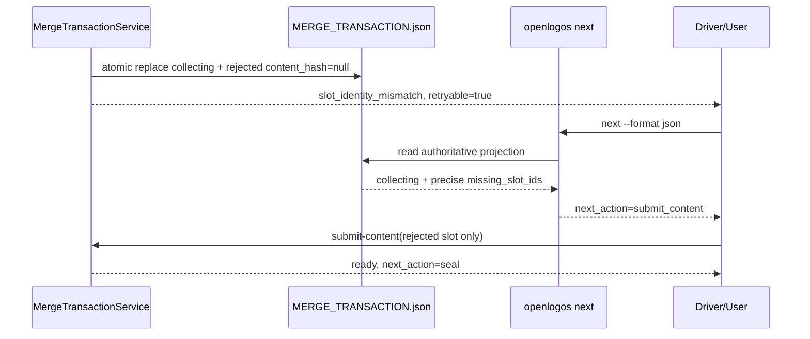

## ADDED — S05 Preflight Reopen 后的 Next 权威动作

### 场景目标

当 seal 或 legacy sealed apply 因可归因内容错误把事务原子退回 collecting 后，`openlogos next` 必须立即指向缺失 slot 的受控重提，不建议 abort、新事务或 apply。

### 主时序

### 投影规则

- collecting 的动作固定为 `submit_content, abort`，`next_action=submit_content`。
- `missing_slot_ids` 只由 transaction 中 `content_sha256=null` 的 required Agent slots 派生；不得扫描残留 merge-content/merge-staging。
- error envelope 不新增字段；消费者收到 retryable 错误后通过 status/next 读取完整 content slot projection。
- 重新 submit 后，只有全部 required slot 非空才进入 ready/指向 seal。
- fatal、mixed attribution、OpenLogos producer error 或 applying/recovery 状态不得返回 submit_content。

### 异常与幂等

- reopen 状态落盘前 response lost：next 仍看到 sealed/apply，重复 apply 重新运行纯 preflight。
- reopen 状态落盘后 response lost：next 看到 collecting，不会因旧私有字节误判 ready。
- 重复 next/status 零写；重复 submit 必须遵守声明 staging path 和原子覆盖协议。

### 追溯

既有 UT-S05-36、ST-S05-20 继续锚定 validator retry 与动作对称；UT-S05-46、ST-S05-21 专门验证 legacy sealed reopen、残留私有字节与 next 动作同源。
