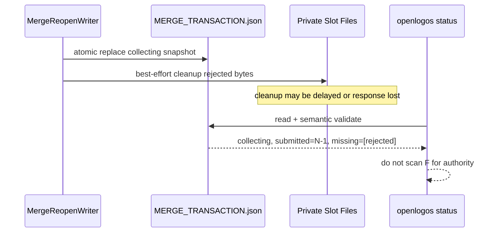

## ADDED — S11 Reopen 与残留私有字节的只读状态投影

### 场景目标

保证 reopen 的提交点是持久化 transaction snapshot；status 不从 merge-content、merge-staging、文件mtime或宿主 ledger 推导 slot状态。

### 主时序

### 投影不变量

- `submitted` 精确等于 Agent items 中 `submitted_sha256 != null` 的数量。
- `missing_slot_ids` 精确等于 required items 中 hash 为 null 的稳定排序 ID。
- collecting/ready 时外层 `seal_sha256=null`；receipt=null、artifact_hashes=[]。
- reopen 后所有 target sealed hash 已清除，避免旧 snapshot 与新 submitted集合混用。
- classification可为本次 `slot_identity_mismatch`，actions仍严格由phase派生。

### 崩溃窗口

| 故障点 | status 权威结果 |
|---|---|
| transaction atomic rename前 | 完整 sealed；下一次 apply重跑preflight |
| rename后、私有清理前 | collecting；残留rejected字节不算submitted |
| 私有清理部分失败 | collecting；未受影响slot与missing集合不变 |
| apply journal存在 | applying/recovery投影；禁止collecting |

### 追溯

UT-S11-74、ST-S11-43以真实磁盘fixture覆盖上述窗口，并继续满足UT-S11-63的collecting projection合同及真只读树hash断言。
