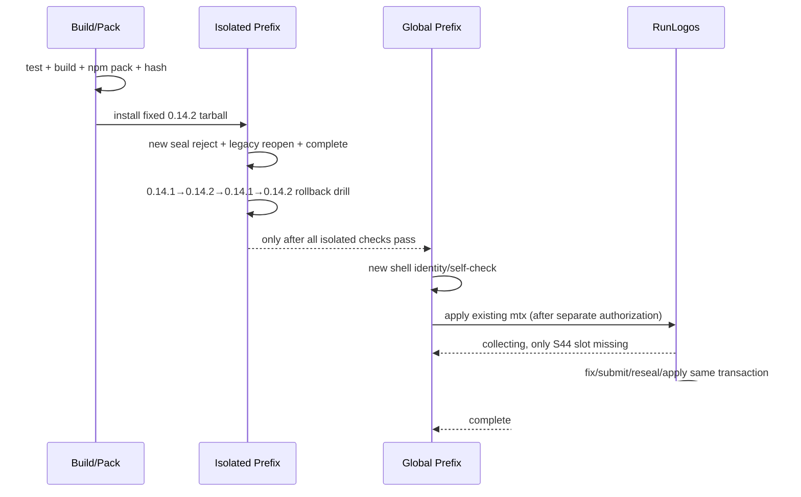

## ADDED — S19 OpenLogos 0.14.2 Preflight/Reopen 候选门

### 场景目标

以真实npm tarball证明0.14.2安装态同时支持新事务seal前拒绝、0.14.1 legacy sealed局部reopen、回滚和RunLogos同事务恢复；源码直跑或mock不能替代。

### 授权与前置条件

1. 规格已明确merge、代码切片全部完成，`openlogos verify`为PASS。
2. 获得本机部署明确授权后才pack/install；获得smoke授权后才运行安装态smoke；获得RunLogos恢复/继续merge授权后才触达该仓库。
3. 冻结0.14.1全局入口、realpath、package/plugin/asset hashes及固定回滚tarball SHA-256。
4. 0.14.2 candidate记录绝对tarball路径、大小、文件清单、SHA-256和随包contract/schema/skill/golden hashes。

### 主时序

### 门禁

- candidate任一hash、入口、schema/skill/golden或最小正反例不符，不覆盖全局。
- 全局安装/新shell自检失败立即用固定0.14.1恢复，验证无混装。
- RunLogos出现不可归因fatal、plan drift、journal/recovery错误时停止，不abort或新建事务掩盖。
- smoke/reporter必须写真实ID与结果；无证据不生成部署/SMOKE成功标记。

### 追溯

UT-S19-24～25、ST-S19-16覆盖candidate identity、隔离回滚和安装态分支；SMOKE-core-160～162覆盖新事务、legacy fixture与RunLogos真实事务。
