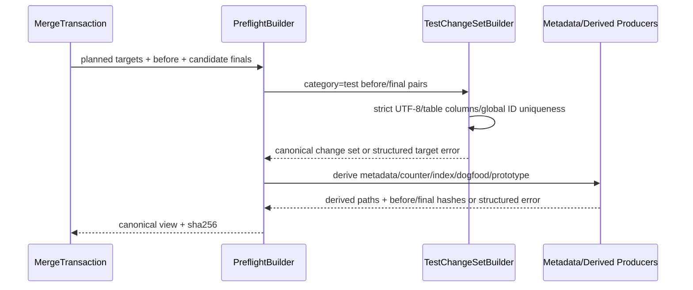

## ADDED — S39 Test-change-set Seal Preflight 与目标归因

### 场景目标

将after测试表严格扫描、`test-change-set`和metadata/counter/index等确定性派生物纳入seal-bound preflight，使内容错误在任何apply状态/journal/正式写入前暴露并可按canonical target归因。

### Preflight 数据流

### Test-change-set 规则

- before继续允许历史重复/歧义候选的单向兼容；after必须严格唯一、列数一致、UTF-8合法。
- `test-change-set-ambiguous-table`、duplicate-id、invalid-utf8等内部错误必须携带canonical `target_paths[]`，不只提供message。
- 单个after test target错误唯一映射到Agent slot时可reopen；多个Agent test targets同时失败可共同reopen。
- duplicate ID跨多个targets且无法安全确定应修哪个slot时不得任意选择；只有结构化错误明确列出全部责任targets且全部可修复时才共同退回，否则fatal。

### 派生目标冻结

metadata/counter/index、test change set hash和最终target paths进入preflight identity。seal/apply间`logos-project.yaml`或任何before漂移必须首写前拒绝，禁止以新metadata重算后继续。receipt/marker字节可含apply时刻`completed_at`，但其确定性payload必须来自sealed view。

### 零写与归因边界

- PreflightBuilder纯只读；不得调用会清理apply staging或恢复journal的写函数。
- legacy sealed apply先检查无journal/receipt/marker/apply artifacts，再运行临时view。
- OpenLogos producer错误、target path无/多映射、mixed fatal时不清任何Agent slot。
- 可归因失败由MergeReopenWriter先原子落盘collecting，再清理rejected私有字节。

### 追溯

UT-S39-56～58与ST-S39-27使用歧义after表、多target duplicate、metadata drift和RunLogos S44 fixture，断言preflight hash、结构化归因、零正式写及同transaction完成。
