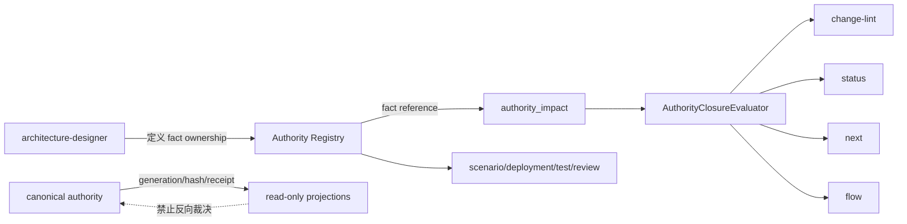

## ADDED — 三十六、Authority Closure 单一语义权威架构

## 三十六、Authority Closure 单一语义权威架构

### 36.1 边界与所有权

- `spec/authority-closure.md`：方法论合同唯一源，拥有术语、schema 与 AC-01～AC-08。
- 项目 Architecture Authority Registry：项目级 fact ownership 唯一实例源。
- `authority_impact`：当前 change 的变化计划，只引用 fact，不重定义 owner 表。
- `AuthorityClosureEvaluator`：Plan Package 中唯一结构化求值者。
- Skill：角色执行投影；package/plugin/cache：由根源构建的资产投影。
- status/next/flow/change-lint/merge precheck：evaluation 消费者，不拥有完成谓词。

### 36.2 Authority Registry 数据模型

```ts
interface AuthorityFact {
  fact_id: string;
  semantic_scope: string;
  authority_owner: string;
  canonical_state: string;
  sole_writer: string;
  mutation_entry: string;
  decision_api: string;
  projections: Array<{
    id: string;
    consumer: string;
    freshness_proof: string;
    rebuild_rule: string;
    writable: false;
  }>;
  recovery_source: string;
  forbidden_shadow_sources: string[];
  cutover_exit: string;
}
```

`fact_id` 表达业务问题而非存储路径。canonical state 可由事务文件、数据库行、事件日志或服务状态承载；物理技术不改变其唯一裁决语义。

### 36.3 数据流与控制流



写控制流只允许 `command → mutation_entry → sole_writer → canonical_state → projection refresh`。读控制流优先 `decision_api → authority decision`；读取 projection 时必须携带 freshness identity。恢复控制流只从 canonical authority/receipt 开始，残留投影只能被校验、丢弃或重建。

### 36.4 Authority Closure evaluator

`AuthorityClosureEvaluator` 严格解析唯一 `openlogos/authority-impact@1`，验证 applicability、fact 引用、字段闭包、真实测试 ID、retired shadow source 与 cutover exit。它返回不可变 evaluation：summary、稳定 issues、ready。调用方只能序列化或派生展示，禁止重新按关键词求值。

Plan Package evaluator 组合该结果与现有 proposal/tasks/clarification/baseline/UI 结果；同一输入只求值一次。change-lint/status/next/flow 可共享函数调用或规范化结果，但不能通过复制 parser 达成“看似一致”。

### 36.5 writer cutover 状态机

```text
planned
  -> authority identity frozen
  -> old writer stopped
  -> new mutation entry enabled
  -> projections rebuilt
  -> freshness/negative probes passed
  -> cutover completed
```

在 `old writer stopped` 之前允许回滚到旧版本；新 writer 已产生不可逆业务写入后，回滚只能恢复兼容 reader/adapter，不能重新开启旧 writer 形成双权威。每阶段必须有持久化证据和幂等重试语义。

### 36.6 失败与恢复策略

- fact 无唯一 owner/writer：plan blocked，回到架构设计。
- projection 无 freshness proof：不得作为 decision 输入；先重建或读 authority。
- 响应丢失/进程重启：按 authority transaction/receipt 查询，不扫描 marker 猜测完成。
- 旧 writer 未关闭或两个 mutation entry 可写：cutover 未闭合，部署/审查 Critical。
- evaluator 输入 malformed：fail closed；不得退化为 not_applicable。
- packaged asset hash 漂移：candidate smoke 失败，恢复冻结安装版本。

### 36.7 实现映射

- parser/evaluator：`cli/src/lib/authority-closure.ts`（名称可在实现切片中按现有模块边界微调，但唯一 evaluator 职责不变）。
- Plan Package 组合：`cli/src/lib/plan-package.ts`。
- CLI 输出：`cli/src/lib/change-lint.ts`、status/next/flow 既有 projection 层。
- proposal scaffold 与资产：CLI templates、根 `skills/`、plugin/build asset manifest。
- UT/ST：S04/S06/S07/S09/S12/S16/S19/S35；安装态：SMOKE-core-163～167。

### 36.8 架构不变量

1. 一个 `fact_id` 只有一个 authority owner/canonical state/sole writer/mutation entry。
2. Registry、proposal、Skill、Decision 和根 spec 的职责不重叠；引用不复制。
3. projection 永不成为 fallback authority，freshness 必须绑定权威 identity。
4. 所有完成消费者共享 evaluator；不得实现第二状态机或第二 parser。
5. writer 迁移必须有终点，不能以长期双写换取表面兼容。
6. 静态门 + 故障注入 + Critical review 共同构成 AC-08，不夸大单一证据能力。
