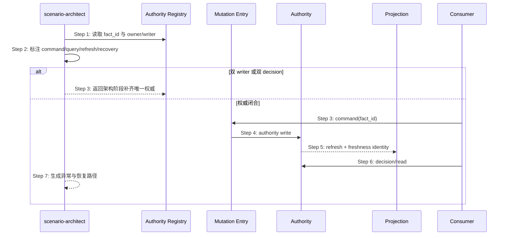

## ADDED — S04 Authority Closure 时序建模扩展

## S04 Authority Closure 时序建模扩展

### 场景目标

当场景涉及共享业务事实时，sequence diagram 必须让唯一 authority、mutation entry、projection 和 consumer decision 可见；若两个参与者能独立 write/decide 同一 `fact_id`，在写场景文档前回退架构设计。

### 参与者与时序

### 步骤说明

1. 读取 Authority Registry，只引用稳定 `fact_id`，不从代码或文件名自造 owner。
2. 每条消息标注 command、authority read/write、projection refresh 或 decision；投影显示 freshness proof。
3. 两个参与者都能改变 canonical state 或给出最终决定时停止交付，回到 architecture-designer。
4. 恢复从 authority/receipt 开始；不得把目录扫描、mtime、marker 存在性画成恢复来源。
5. 场景追溯 AC-01～AC-08 及真实 UT/ST。

### 异常与边界

- **EX-AC-1 双 writer**：报告未闭合，不生成“最后写入胜出”方案。
- **EX-AC-2 stale projection**：identity 不匹配时读 authority 或返回 unavailable，不接受旧值。
- **EX-AC-3 response lost**：按 authority transaction/receipt 查询，不重放不确定写入。

### 追溯

- 规范：`spec/authority-closure.md` AC-01～AC-06。
- 测试：UT-S04-01～UT-S04-04、ST-S04-01。
