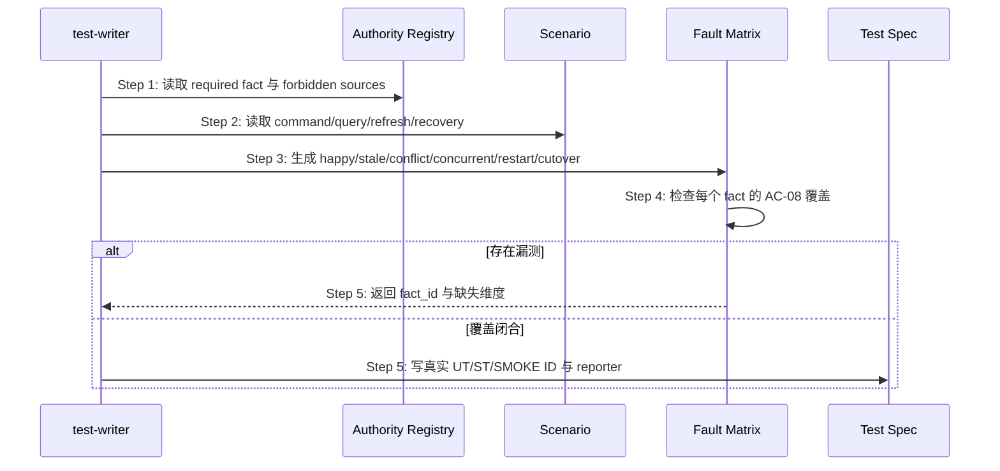

## ADDED — S06 Authority Closure 测试设计扩展

## S06 Authority Closure 测试设计扩展

### 场景目标

test-writer 从 Authority Registry 与时序图派生可证伪矩阵，证明系统在副本冲突、滞后、重启、并发和切换失败时仍只认唯一 authority，而不只验证 happy path。

### 时序图

### 必测矩阵

每个 required fact 至少包含 authority 正常路径、stale projection、conflicting old copy、legacy/concurrent writer、response lost + restart、projection rebuild、cutover rollback、forbidden reverse inference。确实不可发生的项必须引用架构不变量给出证据，不能静默省略。

### 断言边界

- 断言最终决定来自 authority identity/action，不只断言两个值碰巧相等。
- stale/conflict 夹具故意让投影与权威值不同。
- restart 测试启动新进程并保留旧残留，禁止复用内存对象伪装恢复。
- concurrent writer 证明旧入口被拒绝或只由单一协调 writer 串行化。
- 所有自动化测试接入 OpenLogos reporter。

### 追溯

- 规范：AC-04、AC-06、AC-07、AC-08。
- 测试：UT-S06-01～UT-S06-06、ST-S06-01～ST-S06-02。
