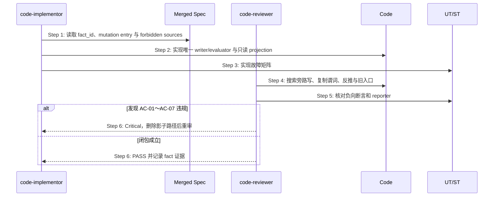

## ADDED — S07 Authority Closure 实现与代码审查扩展

## S07 Authority Closure 实现与代码审查扩展

### 场景目标

实现按已合并 Registry/场景只保留一个 mutation/decision 路径；code-reviewer 在交付前证明旧 writer、旧 parser、fallback scan 和 projection reverse inference 已删除或不可达。

### 时序图

### Critical 判据

- 绕过 mutation entry 直接写 canonical state。
- status/next/flow 等消费者复制完成谓词或状态机。
- catch/恢复分支扫描 marker、mtime、目录或 stale cache 猜权威结果。
- projection 可写或能覆盖 authority；freshness 校验缺失。
- feature flag 永久保留两个 writer，或迁移后旧入口仍可成功。
- 测试只验证值相等，未制造冲突副本或新进程恢复。

### 完成条件

Critical 清零；每个 required fact 可从入口追到唯一 writer/evaluator；旧来源删除或不可达证据明确；对应 UT/ST 通过并由 OpenLogos reporter 记录。

### 追溯

- 规范：AC-02、AC-05～AC-08。
- 测试：UT-S07-01～UT-S07-06、ST-S07-01～ST-S07-02。
