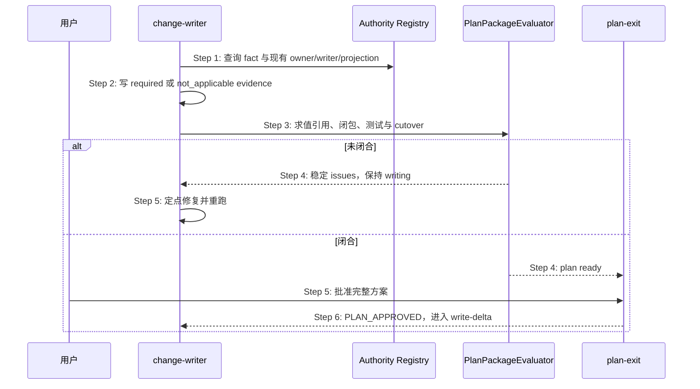

## ADDED — S09 authority_impact Plan 生命周期

## S09 authority_impact Plan 生命周期

### 场景目标

change-writer 在 plan-exit 前完成 Authority Closure 适用性与变化计划；用户批准的是已闭合的 authority 方案，批准后才能生成对应 Delta。

### 时序图

### 生命周期规则

- 新 scaffold 与仍 writing 的提案必须有唯一 authority impact；缺失不得默认为 not applicable。
- proposal 只引用 Registry 或当前 CREATE authority target，不复制 owner 表。
- `unresolved` 非空、测试 ID 不真实、旧 writer 无 stop 或 cutover 无 exit 时 plan 不 ready。
- `PLAN_APPROVED` 只表示方案门已消费，不授权 merge/verify/deploy/smoke/archive/push。
- 已越过 plan 的历史提案不因新合同回退。

### 异常与恢复

- malformed YAML：exit 2 可修复 issue；duplicate key fail closed。
- Registry 引用不存在：回到架构/Delta 计划，不按散文猜 owner。
- plan 批准后 authority impact 漂移：按既有完整性语义重新批准，不静默沿用旧 marker。

### 追溯

- 规范：`openlogos/authority-impact@1`、AC-01～AC-08。
- 测试：UT-S09-266～UT-S09-270、ST-S09-104～ST-S09-105。
