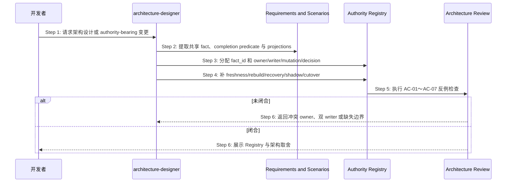

## ADDED — S12 Authority Registry 架构设计扩展

## S12 Authority Registry 架构设计扩展

### 场景目标

architecture-designer 在技术选型之前盘点共享业务事实与完成谓词，为每个适用 fact 建立唯一 Authority Registry row，作为后续场景、部署、测试和审查的实例源。

### 时序图

### 产出规则

1. `fact_id` 以业务语义命名，不绑定文件、表或类。
2. 每行恰有一个 authority owner、canonical state、sole writer 与 mutation entry。
3. 每个 projection 声明 consumer、freshness proof、rebuild rule、`writable:false`。
4. 恢复来源必须是 authority/receipt；列出明确 forbidden shadow sources。
5. ownership 变化必须有有限 cutover exit 和 rollback boundary。
6. 找不到唯一答案时记录未决并停止交付，不以“双方保持同步”代替设计。

### 异常与边界

- **EX-AR-1 共同 owner**：两个组件均可直接裁决；拆分 fact 或选择唯一 owner。
- **EX-AR-2 无 freshness**：投影只能作为 advisory 或移除，不能参与业务决定。
- **EX-AR-3 无法关闭旧 writer**：cutover 未闭合，禁止进入部署设计。

### 追溯

- 规范：`spec/authority-closure.md` §5、AC-01～AC-07。
- 测试：UT-S12-01～UT-S12-06、ST-S12-01。
