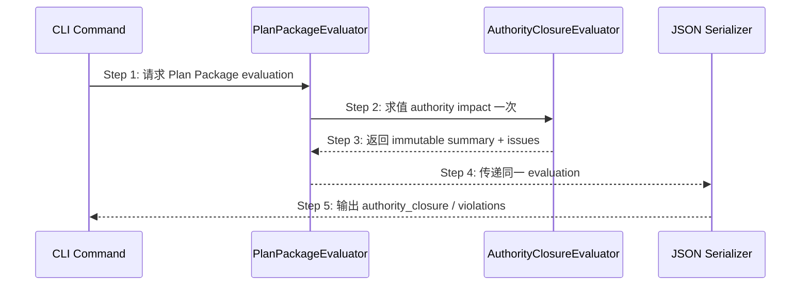

## ADDED — S16 Authority Closure 机器输出

## S16 Authority Closure 机器输出

### 场景目标

change-lint、status、next 与 flow 对同一 proposal 输出来自唯一 AuthorityClosureEvaluation 的稳定摘要和问题，消费方无需也不得重新解析 `authority_impact`。

### 时序图

### 输出合同

`authority_closure` 至少包含 `schema`、`applicability`、`facts_total`、`facts_closed`、`projections`、`retired_shadow_sources`、`unresolved`、`pass`。change-lint violations 使用五个闭合 code；text 与 JSON 共享集合和排序。

required/not_applicable 合法时 summary 在场。未启用新合同的已越过 plan 历史提案可省略以保持兼容；malformed 输入不得伪造 `pass:true` summary。serializer 不补算 pass、不从 message 推断 code。

### 同源约束

同一文件字节下 change-lint、status、next、flow 的 summary 必须深相等；proposal_step 只消费 evaluation.ready。任何命令局部 parser、默认 `not_applicable` 或第二份 issue 排序均为合同违约。

### 追溯

- JSON 规范：`spec/cli-json-output.md` Authority Closure 小节。
- 测试：UT-S16-35～UT-S16-37、ST-S16-11。
