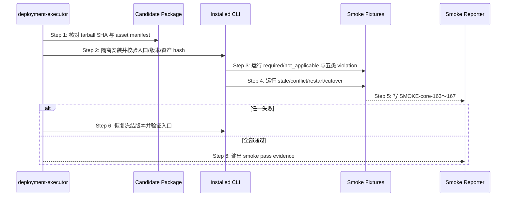

## ADDED — S19 Authority Closure candidate 与 cutover smoke

## S19 Authority Closure candidate 与 cutover smoke

### 场景目标

在隔离安装态证明根规范、六个 Skill、CLI evaluator 和插件/cache 投影来自同一源，并验证 writer cutover、stale projection 与版本回滚不会产生第二权威。

### 时序图

### 门禁

- source Skill、package Skill、plugin/cache 资产与 manifest/hash 一致。
- Authority Closure evaluator 正负例与源码测试一致；status/next/flow 不出现局部重算。
- stale/conflict fixture 只按 authority 得出结论；旧 writer 调用被拒绝。
- 回滚演练后当前版本入口、资产和行为完全恢复；再次安装 candidate 仍幂等。
- 结果由 smoke reporter 写 `logos/resources/verify/smoke-results.jsonl`，禁止手工补写。

### 授权边界

规格 merge、verify、部署和 smoke 是独立确认点。本场景只定义部署后验收，不因 plan 批准自动执行安装或 smoke，也不授权公开 npm 发布。

### 追溯

- 规范：AC-04～AC-08。
- 测试：UT-S19-26～UT-S19-28、ST-S19-17、SMOKE-core-163～SMOKE-core-167。
