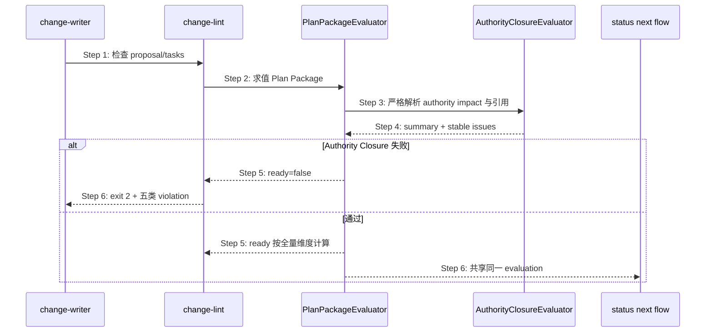

## ADDED — S35 Authority Closure L10 共享求值门

## S35 Authority Closure L10 共享求值门

### 场景目标

在 Plan Package 完成判据中加入 Authority Closure，而不让 change-lint、status、next 和 flow 分别维护 parser。L10 只调用 AuthorityClosureEvaluator 并把同一 issues 纳入完成结果。

### 时序图

### L10 检查项

1. 声明存在且唯一；schema/applicability 分支严格。
2. fact 引用指向 effective architecture/当前 CREATE authority target。
3. owner/writer/mutation/projection/freshness/recovery/shadow/test 字段闭合。
4. cutover old stop/new start/rollback/exit 全部非空，`unresolved=[]`。
5. test IDs 在 effective test view 中真实存在。
6. 多问题不首错短路，按 path、fact 源序、code、message 稳定排序。

### 历史与只读边界

新/仍 writing 提案严格检查；已越过 plan 的历史前沿不倒退。L10 全程只读，不写 proposal、marker 或 Registry。操作错误 exit 1；可修复合同红 exit 2；通过 exit 0。

### 追溯

- 规范：`spec/authority-closure.md` §7～§9。
- 测试：UT-S35-112～UT-S35-120、ST-S35-19～ST-S35-21。
