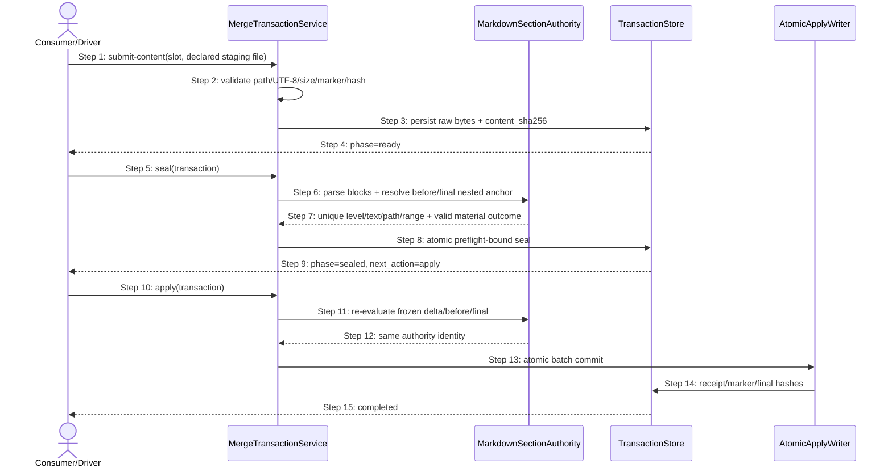
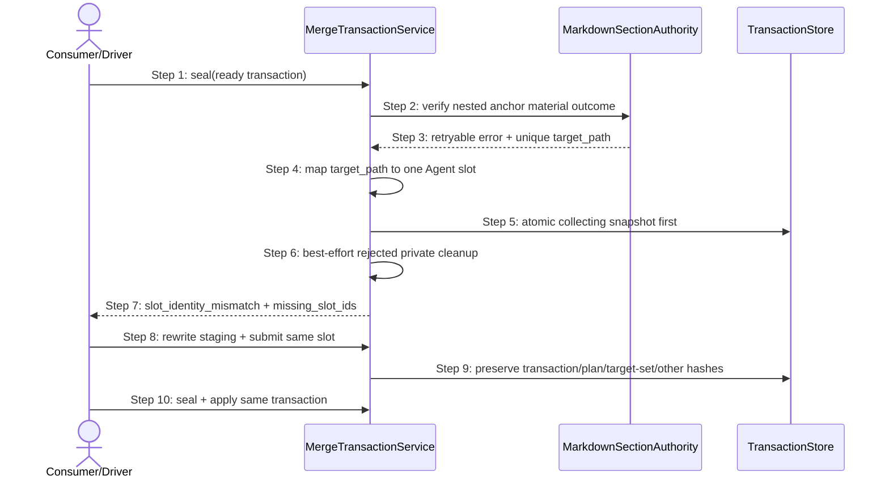

## ADDED — S09 嵌套章节锚 Slot 的 Seal Preflight 与同事务恢复时序

### 场景目标

让合法 `MODIFIED — 父标题 > 叶标题` Agent content 在原始 slot submit 后通过共享 section-anchor authority 完成 seal/apply；若内容确实不满足嵌套锚合同，只局部 reopen 可归因 slot并保持 transaction 其它身份。

### 参与者

- **消费者/Driver**：只写声明 staging path，调用 transaction 公共 action。
- **MergeTransactionService**：拥有 submit、seal、reopen、apply 状态转换。
- **MarkdownSectionAuthority**：共享解析 Delta block、heading tree、路径锚和物质结果。
- **TransactionStore**：原子持久化 slot hash、phase、seal 与 preflight identity。
- **AtomicApplyWriter**：在 sealed identity 复核后批量提交正式目标与 receipt。

### 前置条件

- transaction 处于 `collecting`，Delta source、before target、plan 与 target set hash 未漂移。
- Agent target 的 staging path 已声明，最终内容是合法 UTF-8 普通文件且不含围栏外 Delta 控制 marker。
- Delta 使用标题路径锚，父标题与叶标题在 before/final heading tree 中形成唯一层级链。

### 成功后置条件

- 同一 transaction 依次达到 ready、sealed、applying、completed，正式目标不含字面量路径标题。
- preflight/seal/receipt 绑定同一 parser/resolver result 与 source/before/content/final hash。
- 其它 submitted slot hash、plan hash 与 target set 全程不变；OpenLogos reporter 记录真实 UT/ST 证据。

### 主时序

### 步骤说明

1. 消费者将完整最终目标写到 transaction 声明的 staging path，再调用 `submit-content`；该动作不解析章节锚。
2. MergeTransactionService 完成原始字节安全检查并写入 slot hash；最后一个必需 slot 到达时只把 phase 推到 ready。
3. seal preflight 将冻结 Delta、before 与 final 交给 MarkdownSectionAuthority，一次获得 fence-aware block 与唯一真实 heading hit。
4. 对 MODIFIED 路径，authority 验证 before/final 的父子链、叶标题 level/text 与完整正文结果，不要求字面量路径 heading。
5. 验证通过后 transaction 原子写 sealed/preflight identity；apply 首写前对完全相同的冻结输入重验。
6. 只有 identity 相同才进入 AtomicApplyWriter；完成 receipt 与正式目标 hash 成为恢复来源。

### 可修复局部 Reopen 时序

### 异常与边界

#### EX-MT-ANCHOR-1：字面量路径标题伪修复

- **触发条件**：final 新增 `## 父标题 > 叶标题`，但真实父/叶层级未按 Delta 修改。
- **期望响应**：seal preflight 拒绝并只退回该 Agent slot；禁止将伪标题视为唯一 hit。
- **副作用**：正式目标、receipt、marker、journal 与其它 slot hash 不变。

#### EX-MT-ANCHOR-2：叶标题重复或父链错误

- **触发条件**：只按叶标题可命中多个候选，或 final 将叶标题移到错误父章节。
- **期望响应**：authority 返回 ambiguous/not-found 或路径身份漂移；不得首命中、合并候选或按正文猜测。
- **副作用**：若无法唯一归因到 Agent target，则一个 slot 也不清。

#### EX-MT-ANCHOR-3：Apply 重验漂移

- **触发条件**：seal 后 source、before、slot bytes 或 parser result identity 漂移。
- **期望响应**：首写前以 source/before/seal mismatch fail-closed，不 reopen sealed 新事务，不静默重建 seal。
- **副作用**：正式树及 apply journal 保持未写。

#### EX-MT-ANCHOR-4：Response lost

- **触发条件**：reopen 或 apply 已原子提交但命令响应丢失。
- **期望响应**：新进程先读 status/recover，从 transaction/receipt 得到 collecting 或 completed 唯一状态。
- **副作用**：不扫描残留 slot/staging/marker反推，不 abort、不新建 transaction。

### 追溯

- 需求：AC-MT-ANCHOR-01、03～05、07。
- 功能规格：§2.46.1～§2.46.5。
- 架构：§37.2～§37.6。
- 测试：UT-S09-271～274、ST-S09-106～107；安装态 SMOKE-core-168。
