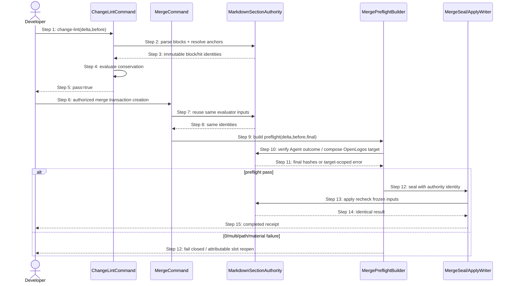

## ADDED — Merge Transaction 消费 S37 Section Anchor Authority 时序

### 场景目标

把 S37 的 fence-aware block/heading-tree/唯一锚能力从 change-lint 私有实现提升为 `delta.section-anchor-resolution` 共享 authority，使 lint、merge precheck、transaction Agent verifier 与 OpenLogos composer 对同一 Delta/before/final 给出可复算的一致结论。

### 参与者

- **ChangeLintCommand**：读取有效目标与 Delta，消费共享解析结果完成 L8 对账。
- **MergeCommand**：在创建 transaction 前复用 L8 evaluator，不复制 parser。
- **MarkdownSectionAuthority**：唯一解析控制块、标题树、路径锚与真实章节范围。
- **MergePreflightBuilder**：为 Agent/OpenLogos target 构造 candidate final 与结构化错误事实。
- **MergeSealWriter/ApplyWriter**：只消费 authority 决定和 hash，不自行解释章节锚。

### 前置条件

- Delta 与目标均为冻结、可读的 Markdown 字节；代码围栏可能包含伪 heading 或伪控制 marker。
- 标题路径锚使用精确 ` > ` 连接祖先到叶标题；重复叶标题必须通过完整父链消歧。
- Authority Registry 中 `delta.section-anchor-resolution` 的 owner、writer、decision API、投影与 recovery source 已唯一登记。

### 成功后置条件

- 同一输入在 lint、preflight 与 apply 重验中得到相同 block 序列和 `level/text/path/start/end`。
- Agent final bytes 和 OpenLogos composed bytes 都满足同一物质操作后置条件，且正式文档不存在字面量路径标题。
- 任一旧私有 parser/regex 与 authority 结论冲突时，旧来源不可达且不能作为 fallback。

### 同源消费时序

### 步骤说明

1. change-lint 对有效视图只调用共享 parser/resolver，再由 ConservationEvaluator 做结构化 ID existing/retained 对账。
2. MergeCommand 的纵深检查消费同一 evaluator，禁止在 transaction 创建前形成另一份锚解析结论。
3. MergePreflightBuilder 对 Agent target 读取已提交 final bytes，对 OpenLogos target 调用共享 composer；二者都绑定相同 source/before hit identity。
4. seal 保存 candidate hashes 与 preflight identity；apply 首写前重算并比较，不能因重新解析得到不同候选而静默接受。
5. 可归因 Agent 错误交给 S09 局部 reopen；OpenLogos/mixed/unknown 错误保持 fatal，避免错误清空正确 slot。

### 异常与边界

#### EX-AUTH-37-1：代码围栏内伪 marker

- **触发条件**：Delta 正文围栏中出现 `## MODIFIED — 伪章节` 或目标围栏内出现同名 heading。
- **期望响应**：共享 parser 忽略围栏内容，lint/preflight/composer block 数量与命中位置一致。
- **副作用**：不得生成额外 writer、章节替换或 slot reopen。

#### EX-AUTH-37-2：重复叶标题与错误父链

- **触发条件**：目标存在两个同名叶标题，Delta 使用单段锚或不存在的父级路径。
- **期望响应**：所有消费者稳定返回 ambiguous/not-found；禁止叶标题首命中和正文相似度回退。
- **副作用**：lint 只读，merge 不形成正式写入；transaction 仅在结构化归因成立时局部 reopen。

#### EX-AUTH-37-3：旧 parser 冲突

- **触发条件**：旧 `parseDeltaSections`、扁平 heading regex 或精确 H2 matcher 会得出与共享 authority 不同的结果。
- **期望响应**：实现中旧分支已删除或不可达；测试以冲突夹具证明没有 catch/feature flag/legacy fallback。
- **副作用**：不能选择“更宽松”的旧结论继续 seal/apply。

#### EX-AUTH-37-4：投影过期或响应丢失

- **触发条件**：缓存的 lint/preflight result 与 source/before/content hash 不匹配，或 seal/apply 响应丢失。
- **期望响应**：从冻结 authority inputs、transaction 与 receipt 重建；mtime、marker存在性和残留 staging 不构成 freshness。
- **副作用**：只得到 collecting/sealed/completed 唯一状态，不反向改写 authority。

### API、数据库与安全边界

- 本场景只处理本地 CLI Markdown 字节和 transaction 制品，不产生 HTTP/RPC/消息 API、DB/DDL 或 API orchestration。
- 继续执行 containment、symlink、UTF-8、大小、SHA-256、atomic rename 和 journal 安全边界。
- 不改变 `ChangeLintViolationCode`、transaction 公共 JSON 或 reporter schema。

### 追溯

- 需求：AC-MT-ANCHOR-01～05。
- 功能规格：§2.46.2～§2.46.4。
- 架构：§37.1～§37.6，fact `delta.section-anchor-resolution`。
- 测试：UT-S37-37～40、ST-S37-09～10；生命周期联测 UT-S09-271～274、ST-S09-106～107。
