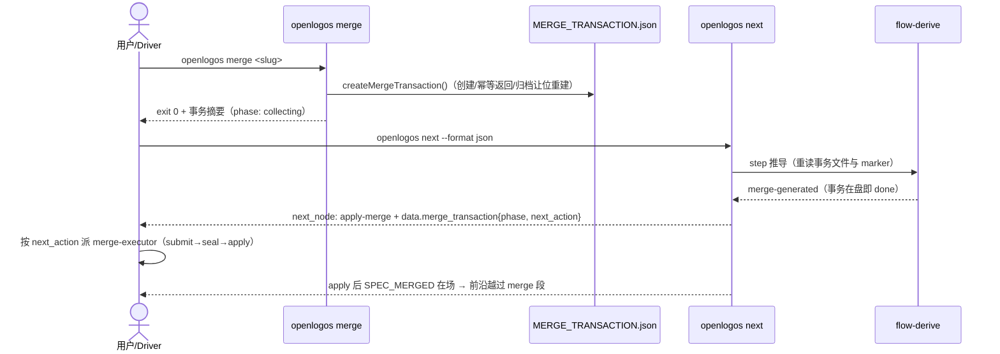

## ADDED — S05 merge 事务各相位的 next 引导时序

### 场景目标

`openlogos merge` 开启合并事务后，`next` 立即推进前沿并按事务相位给出与 `next_action` 一致的引导，用户与宿主 driver 无需 stat 事务文件即可分流。

### 前置与后置条件

- 前置：launched 提案完成 delta 审核（`ready-to-merge`），用户/driver 已授权 merge。
- 成功后置：merge exit 0 后 `proposal_step: merge-generated`、`next_node: apply-merge`；事务各相位下引导与事务 `next_action` 一致；apply 完成后前沿越过 merge 段。
- 失败后置：status/next 读取失败输出结构化 `error.code`；存量失配事务 fail-closed 并给稳定码与 remediation。

### 主时序

### 步骤与不变量

1. `flow-derive` 与 `launched.yaml` `done_when` 同判据（事务在盘 ∨ legacy marker），两处一致由回归钉死。
2. 各相位引导映射：collecting→submit-content、ready→seal、sealed→apply、completed→SPEC_MERGED 已写、failed→按 classification 给 recover/abort；`next` 只透传事务 `next_action`，不改写。
3. 活跃事务在场时 `data.merge_transaction` 必挂且与 `merge transaction status` 同快照一致。
4. no-delta 提案不经本时序（当场 `SPEC_MERGED`）。

### 异常

- `EX-MF-S05-1`：事务文件损坏不可读 → status/next fail-closed，输出结构化 `error.code`，不猜测前沿。
- `EX-MF-S05-2`：存量事务 contract/schema 失配 → 稳定错误码 + 双方版本摘要 + remediation（abort 后重开）。

### 追溯

- 需求：merge 流程契约自洽需求「S05 next 引导」。
- 架构：四十七、merge 前沿推进判据与事务事实同源。
- 测试：UT-S05-52～UT-S05-55、ST-S05-24～ST-S05-25。
