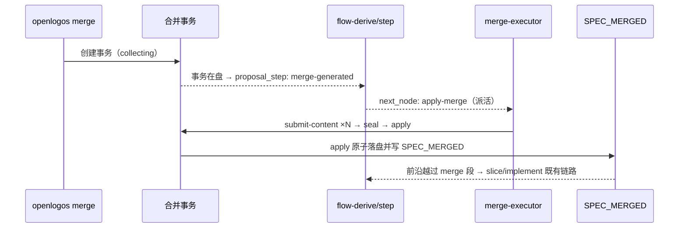

## ADDED — S09 merge 事务前沿推进生产链路时序（flow 契约自洽）

### 场景目标

launched 变更在 0.14.x 事务语义下，merge 段的 flow 前沿与生产事实全链自洽：「开事务 → step 推进 merge-generated → apply-merge 派活 → 事务 apply 写 SPEC_MERGED → coding」，无死区；legacy 测试模式（marker 路径）行为保持不变。

### 前置与后置条件

- 前置：提案 `ready-to-merge`，merge 获授权。
- 成功后置：每一步的 `proposal_step` / `next_node` 与磁盘事实一致；`SPEC_MERGED` 后进入 slice/implement 既有链路。
- 失败后置：事务失败相位不冻结前沿（terminal 走 0.14.17 终态出路：abort 重建 / reopen）；status/next 失败输出结构化 `error.code`。

### 主时序

### 步骤与不变量

1. `done_when: any_present:[MERGE_TRANSACTION.json, MERGE_PROMPT_GENERATED, MERGE_PROMPT.md]`——事务在盘即 done；legacy 测试 marker 兼容或项，0.13.x 合同回归不破。
2. merge 幂等：非终态事务在场时重跑 merge 幂等返回、前沿不回退；终态按 §2.58.1 归档让位重建（新事务同样使前沿为 merge-generated）。
3. `proposal_step` 闭合枚举、step 注册表（merge-generated: pre-implement/command-required）、禁止抢占前沿规则一字不改。
4. 后置条件二分为跨仓合同：宿主以「exit 0 + 事务在盘且 phase 合法」判本跳成功；「apply 前沿停顿」是合法中间态。

### 异常

- `EX-MF-S09-1`：事务 failed（fatal / aborted）→ 前沿仍 merge-generated（事务在盘），引导按 classification 给 abort/recover；重跑 merge 归档让位重建，不死锁。
- `EX-MF-S09-2`：手工删除事务文件（越权）→ 前沿回退 ready-to-merge（事实消失），guard/review 层处置，flow 不猜测。
- `EX-MF-S09-3`：存量事务合同失配 → fail-closed 稳定码 + remediation（abort 后重开），不迁移。

### 追溯

- 需求：merge 流程契约自洽需求「S09 变更生命周期」。
- 架构：四十七（authority cutover）；功能规格 §2.60.2/§2.60.3。
- 测试：UT-S09-303～UT-S09-308、ST-S09-116～ST-S09-117、SMOKE-core-190。
