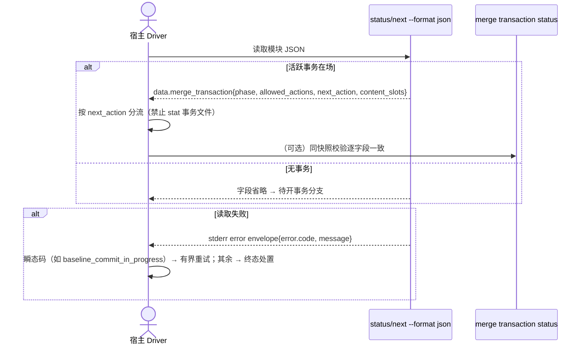

## ADDED — S16 merge 事务投影必挂与失败路径结构化错误码的机器消费时序

### 场景目标

宿主（RunLogos driver 等）只经 `status` / `next` 的机器 JSON 即可完成 merge 段分流与有界错误恢复：活跃事务在场时 `data.merge_transaction` 必挂；所有失败路径携带稳定 `error.code`。

### 前置与后置条件

- 前置：宿主锁定当前 CLI 合同版本（安装态自描述）。
- 成功后置：宿主分流「待开事务 / collecting / ready / sealed / completed / failed」只读投影完成；失败按稳定码走瞬态恢复或落终态。
- 失败后置：无码纯文本失败视为合同回归。

### 主时序

### 步骤与不变量

1. **投影必挂**：活跃提案目录存在 `MERGE_TRANSACTION.json` ⇒ `data.merge_transaction` 必在场（升格自「可挂载」）；与 `merge transaction status` 同快照逐字段一致；`next` 不覆盖 `allowed_actions` / `next_action`。
2. **错误码验收**：status/next 全部失败路径输出结构化 `error.code`；瞬态类码集合稳定、变更走合同版本；回归用例逐失败路径断言。
3. **存量事务失配**：contract/schema 摘要不一致 ⇒ 动作 fail-closed、稳定码、details 含双方版本与摘要 + remediation（abort 后重开）；status 只读投影可展示已知字段。
4. 合同版本自描述（version / schema id / sha256）既有机制不变。

### 异常

- `EX-MF-S16-1`：某失败路径退化为无码纯文本 stderr → 回归用例红，合同缺陷。
- `EX-MF-S16-2`：投影与 transaction status 字段漂移 → 同快照一致性断言红。

### 追溯

- 需求：merge 流程契约自洽需求「机器消费要求」。
- 规格：`spec/cli-json-output.md` merge transaction 契约（投影必挂、稳定错误、错误码验收）。
- 测试：UT-S16-38～UT-S16-41、ST-S16-12～ST-S16-13。
