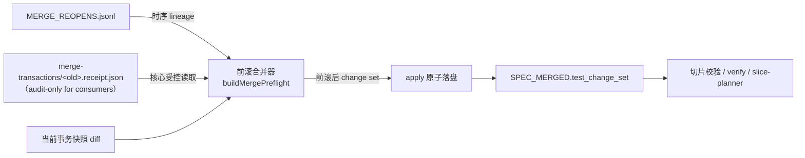

## ADDED — 四十八、test change set 提案级权威与 reopen 前滚合并

<a id="test-change-set-proposal-scope"></a>

### 组件职责

- **TestChangeSetBuilder（`buildTestChangeSet`）**：保持纯函数——对给定 targets 快照对计算语义 diff。不感知 reopen。
- **前滚合并器（buildMergePreflight 内）**：唯一新增职责点。构建当前快照 diff 后，读取 `MERGE_REOPENS.jsonl` 与其点名的归档 receipt，按重开时序前滚合并 changed/removed（changed 前滚并集、removed 后写胜出），targets/hash 保持当前快照、sha256 重算。seal 与 apply 共用此构建点，保证 preflight 摘要与最终 marker 同源。
- **MergeTransactionService（apply）**：唯一 writer 不变；前滚后的 change set 随 receipt 与 `SPEC_MERGED` 经 `applyBaselineClosureBatch` 原子落盘。
- **消费者（TestChangeSetReader / validateTestSliceManifest / slice-aware verify / slice-planner）**：零变化——仍只读当前 `SPEC_MERGED.test_change_set`。

### 数据流



### Authority Registry 追加行

```yaml
- fact_id: test-change-set.proposal-scope
  semantic_scope: 某提案引入/修改/删除了哪些测试 ID（提案级累计事实，非「最近一次事务的快照 diff」）
  authority_owner: merge apply 的 test change set 构建器（buildMergePreflight 唯一构建点，seal/apply 同源）
  canonical_state: 当前 SPEC_MERGED.test_change_set（schema openlogos/test-change-set@1；存在 reopen 留痕时为前滚合并结果）
  sole_writer: merge 事务 apply（applyBaselineClosureBatch 原子落盘；前滚只发生在该 writer 内部）
  mutation_entry: openlogos merge transaction apply（含 reopen 重建后的二次 apply）
  decision_api: readTestChangeSet / validateTestChangeSet（接口与 schema 不变）
  projections:
    - id: slice-manifest-owned-subset-check
      consumer: validateTestSliceManifest 的 owned⊆changed 校验
      freshness_proof: 每次校验重读当前 marker 并验 payload hash 与 target after hash
      rebuild_rule: marker 随 apply 重算重写；不可信时 fail-closed 阻断，不回退推导
      writable: false
    - id: slice-aware-verify-exemption
      consumer: slice-aware verify 的按切片归属豁免
      freshness_proof: 与 owned⊆changed 同一 reader 同源
      rebuild_rule: 同上
      writable: false
    - id: slice-planner-cr-source
      consumer: slice-planner 的 C/R 唯一来源
      freshness_proof: 规划时读取当前 marker，无缓存
      rebuild_rule: 同上
      writable: false
  recovery_source: 提案目录 SPEC_MERGED、MERGE_REOPENS.jsonl 与 merge-transactions/ 归档 receipt（后者仅供核心前滚与审计）
  retired_shadow_sources:
    - transaction-local-diff-as-proposal-change-set
  forbidden_shadow_sources:
    - consumer-union-archived-receipts-to-adjudicate
    - derive-change-set-from-deltas-or-git
    - hand-edit-spec-merged-test-change-set
    - runner-selectors-as-authoritative-ownership
  cutover_exit: reopen 后部分幂等重合并的 changed_test_ids 保持提案级完整、多切片 owned 校验通过（UT-S09-309～312、ST-S09-118～119、UT-S32-69～70、ST-S32-23、SMOKE-core-191），固定 0.14.19 对照复现空 change set；无留痕提案与 0.14.19 逐字节一致
```

### 不变量

1. 前滚只在核心 apply 路径内发生；任何消费者读取归档 receipt 裁决均属 forbidden fallback。
2. preflight `test_change_set_sha256` 与 `SPEC_MERGED.test_change_set.sha256` 恒同源（同一构建点产物）。
3. changed/removed 前滚后仍满足 v1 schema 全部校验（排序、去重、不相交、targets 与 baseline plan 一致）。
