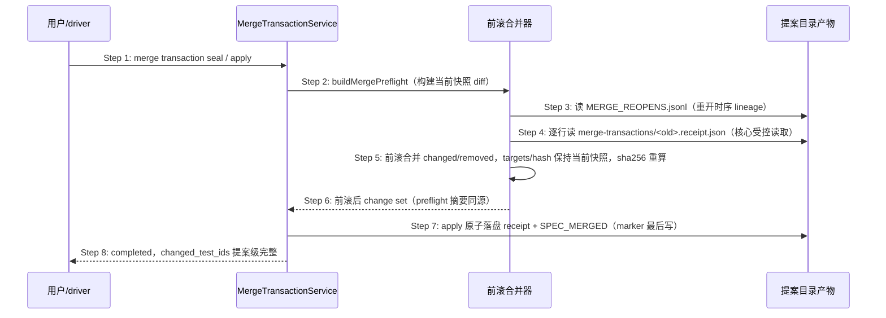

## ADDED — S09 reopen 重合并的 test change set 前滚时序

### 场景目标

completed 合并事务经受控 `reopen` 后重合并时，apply 写出的 `SPEC_MERGED.test_change_set` 前滚合并归档 receipt 的测试变化事实，保证提案级 changed/removed 完整；祖先 receipt 身份失配 fail-closed。

### 参与者

- **用户 / driver**：发起 reopen 与重合并命令链。
- **MergeTransactionService**：submit/seal/apply 状态机与唯一 writer。
- **前滚合并器（buildMergePreflight 内）**：读取 reopen lineage 与归档 receipt，前滚合并 change set。
- **提案目录产物**：`MERGE_REOPENS.jsonl`、`merge-transactions/<id>.receipt.json`、`SPEC_MERGED`。

### 前置条件

提案曾 completed 且已 `reopen --reason ... [--confirm-spec-merged]`（留痕 + 归档 + 作废按序完成）；修正 delta 就位，其余 delta 幂等（与已合并状态一致）。

### 成功后置条件

`SPEC_MERGED.test_change_set.changed_test_ids` 包含首轮引入且未被本轮删除的全部测试 ID；removed 后写胜出；sha256 与 sealed preflight 摘要同源一致。

### 时序图

### 步骤说明

1. **用户/driver** 在 reopen 重建的事务上照常执行 submit → seal → apply。
2. **MergeTransactionService** 在 seal 与 apply 共用的 `buildMergePreflight` 构建当前事务快照 diff。
3. **前滚合并器** 读取 `MERGE_REOPENS.jsonl` 获得重开时序 lineage（行序即时序）。
4. **前滚合并器** 对每行 `old_transaction_id` 读取对应归档 receipt；行无 receipt（abort 祖先）跳过，receipt `test_change_set` 为 null 记空集。
5. **前滚合并器** 按 `changed=(prev∖cur_removed)∪cur_changed、removed=(prev∖cur_changed)∪cur_removed` 从最早祖先前滚到当前快照 diff；targets 与 hash 保持当前快照，sha256 重算，落盘前执行既有 overlap/排序校验。
6. **MergeTransactionService** 以前滚后 change set 计算 preflight `test_change_set_sha256`（seal 摘要与 apply 落盘同源）。
7. **MergeTransactionService** 经 `applyBaselineClosureBatch` 原子落盘 receipt 与 `SPEC_MERGED`。
8. 下游切片校验按提案级 changed 正常放行 owned 归属。

### 异常与边界

#### EX-48.1：祖先 receipt 身份失配
- **触发条件**：归档 receipt 的 change/module/source 与当前提案身份不一致。
- **期望响应**：seal/apply fail-closed，稳定错误信息含失配 receipt 路径与双方身份；不静默跳过、不降级为快照 diff。
- **副作用**：无写副作用；事务留在原相位可 abort 处置。

#### EX-48.2：留痕或 receipt 损坏
- **触发条件**：`MERGE_REOPENS.jsonl` 行或 receipt JSON 不可解析。
- **期望响应**：fail-closed 拒绝并点名损坏路径。
- **副作用**：无。

#### EX-48.3：无留痕提案
- **触发条件**：提案从未 reopen。
- **期望响应**：不读任何归档，行为与 0.14.19 逐字节一致。
- **副作用**：无。

#### EX-48.4：多次 reopen 链式前滚
- **触发条件**：提案 reopen ≥2 次，`merge-transactions/` 有多个 receipt。
- **期望响应**：按留痕行序依次前滚，结果与单次等价语义一致（结合律成立）。
- **副作用**：无。

### 追溯

- 需求：reopen 后 test change set 提案级前滚需求。
- 测试：UT-S09-309～312、ST-S09-118～119、SMOKE-core-191。
