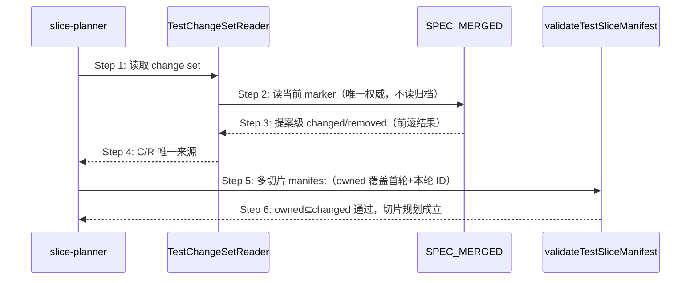

## ADDED — S32 change set 提案级语义与 reopen 后切片归属

### 场景目标

明确 `SPEC_MERGED.test_change_set` 的消费语义为**提案级累计事实**：reopen 重合并后，切片规划与校验读到的 changed/removed 表达「本提案引入/修改/删除了哪些测试 ID」，多切片方案（owned 归属 + 删后续证伪门）在 reopen 后依然成立。消费侧代码零变化。

### 参与者

- **slice-planner**：以 changed 为 C/R 唯一来源划分切片。
- **validateTestSliceManifest**：owned⊆changed 双向强校验。
- **slice-aware verify**：按切片归属豁免未完成切片 ID。
- **merge apply（生产者）**：前滚合并后写出提案级 change set（时序见 S09）。

### 前置条件

提案经 reopen 重合并 completed，`SPEC_MERGED.test_change_set` 为前滚合并结果。

### 成功后置条件

本提案真实新增的每个测试 ID 均可被某切片 own（不再触发 `test-slice-test-id-unknown`）；多切片规划与删后续全量 verify 成立。

### 时序图

### 步骤说明

1. **slice-planner** 经共享 TestChangeSetReader 读取 change set，不感知提案是否经历 reopen。
2. **TestChangeSetReader** 只读当前 `SPEC_MERGED.test_change_set` 并校验 payload hash 与 target after hash；归档事务/receipt 对消费者保持 audit-only。
3. 前滚结果使 changed 含首轮引入且未删除的全部 ID。
4. **slice-planner** 按 C/R 正常划分多切片。
5. **validateTestSliceManifest** 的 owned⊆changed 校验对本提案真实 ID 全部放行；removed 后写胜出（被本轮删除的 ID 不在 changed、出现在 removed，own 之即报 `test-slice-test-id-unknown`）。
6. slice-aware verify 按归属豁免未完成切片 ID，删后续证伪门可成立。

### 异常与边界

#### EX-49.1：消费者试图读归档补齐
- **触发条件**：任何消费者在 changed 缺失时读取 `merge-transactions/` 并集裁决。
- **期望响应**：禁止（forbidden fallback）；change set 不可信时按既有分层阻断（`manifest_status=invalid` / human action required），不回退推导。
- **副作用**：无。

#### EX-49.2：change set 为前滚结果但被篡改
- **触发条件**：payload hash 或 target hash 漂移。
- **期望响应**：与既有行为一致——精确 `test-slice-change-set-*` violation 阻断，零 Gate/loop/runner 副作用。
- **副作用**：无。

### 追溯

- 需求：reopen 后 test change set 提案级前滚需求。
- 测试：UT-S32-69～70、ST-S32-23、SMOKE-core-191。
