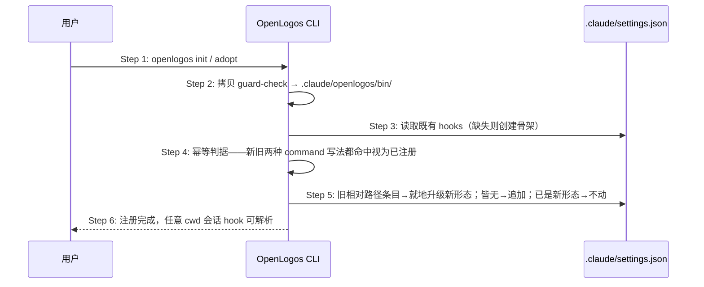

## ADDED — S01 Claude hook 项目根形态注册与幂等迁移时序

### 场景目标

`openlogos init`/`adopt` 为 Claude Code 写入的 PreToolUse 与 SessionStart hook 以 `$CLAUDE_PROJECT_DIR` 项目根形态注册，任意会话 cwd 下可被 Claude Code 正确解析；重复执行幂等，旧相对路径条目升级迁移。

### 参与者

- **用户**：运行 `openlogos init` / `openlogos adopt`。
- **OpenLogos CLI（init/adopt）**：部署 guard bin 与合并 settings.json。
- **`.claude/settings.json`**：hook 注册载体（用户自有条目必须字节保真）。

### 前置条件

项目选择 Claude Code 适配（ai-tool 含 claude-code）。

### 成功后置条件

`settings.json` 的 PreToolUse command 为 `"$CLAUDE_PROJECT_DIR"/.claude/openlogos/bin/guard-check`，SessionStart command 为含 `$CLAUDE_PROJECT_DIR` 的等价形态；无重复条目、无旧相对路径残留；用户自有 hooks 字节不变。

### 时序图

### 步骤说明

1. **用户** 运行 init 或 adopt（两者共用同一部署函数族）。
2. **CLI** 落盘 guard-check bin（既有行为不变）。
3. **CLI** 读取 settings.json；SessionStart 合并先行创建骨架的既有顺序保持。
4. **CLI** 以「新形态 `"$CLAUDE_PROJECT_DIR"/...` 或旧相对形态」双写法匹配判定已注册，杜绝升级后重复注册或漏迁移。
5. **CLI** 按匹配结果迁移/追加/跳过；PreToolUse 与 SessionStart 同规则。
6. 非项目根 cwd 的会话由 Claude Code 用 `$CLAUDE_PROJECT_DIR` 解析到脚本（消除 `No such file or directory`）。

### 异常与边界

#### EX-50.1：settings.json 含用户自有 hooks
- **触发条件**：用户已注册自己的 PreToolUse/SessionStart 条目。
- **期望响应**：只迁移/追加 OpenLogos 自有条目，用户条目字节不变（既有合并保真语义）。
- **副作用**：无。

#### EX-50.2：重复 init / adopt
- **触发条件**：对已注册新形态的项目重复执行。
- **期望响应**：零重复条目、settings.json 语义不变。
- **副作用**：无。

#### EX-50.3：新旧条目同时在场（历史异常态）
- **触发条件**：settings.json 同时含旧相对与新形态条目。
- **期望响应**：去重收敛为唯一新形态条目。
- **副作用**：无。

### 追溯

- 需求：Claude guard hook 项目根定位与 sync 补齐需求「hook 注册形态要求」。
- 测试：UT-S01-137～138、ST-S01-30。
