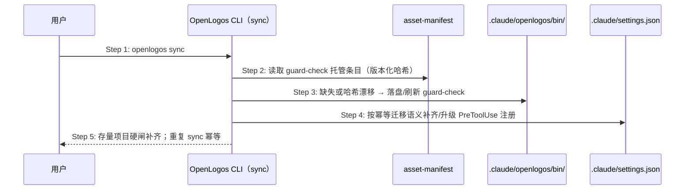

## ADDED — S08 sync 托管 guard 资产补齐时序

### 场景目标

`openlogos sync` 的托管资产面纳入 Claude guard 资产（guard-check bin + PreToolUse hook 注册），使 guard 功能上线前 init 的存量项目升级 CLI 后一次 sync 即补齐硬闸；重复 sync 幂等。兑现 `spec/directory-convention.md` 既有「init / sync 自动部署」承诺。

### 参与者

- **用户**：升级全局 CLI 后运行 `openlogos sync`。
- **OpenLogos CLI（sync）**：托管资产比对与刷新。
- **asset-manifest**：guard-check 条目的版本化哈希登记（与 skills/AGENTS.md 同一机制）。
- **`.claude/openlogos/bin/` 与 `.claude/settings.json`**：部署目标。

### 前置条件

项目为 Claude Code 适配；存量项目可能完全没有 guard-check 与 PreToolUse 段。

### 成功后置条件

guard-check 落盘且哈希与随包资产一致；PreToolUse hook 以 `$CLAUDE_PROJECT_DIR` 形态注册；旧相对路径条目被迁移；重复 sync 零变化。

### 时序图

### 步骤说明

1. **用户** 在任意 OpenLogos Claude 项目运行 sync。
2. **CLI** 从 asset-manifest 读取 guard-check 托管条目，与磁盘比对哈希。
3. **CLI** 缺失/漂移时以随包字节落盘刷新（不覆盖非托管文件）。
4. **CLI** 复用 init 的 `mergeClaudePreToolUseGuard` 幂等迁移语义（新旧 command 双写法匹配）补齐 hook 注册。
5. 存量项目自此获得硬闸；已就绪项目 sync 后零变化。

### 异常与边界

#### EX-51.1：非 Claude 宿主项目
- **触发条件**：项目未选择 claude-code 适配。
- **期望响应**：guard 资产不部署、settings.json 不触碰（与既有托管资产宿主分流一致）。
- **副作用**：无。

#### EX-51.2：用户手改过 guard-check
- **触发条件**：磁盘 guard-check 哈希与 manifest 登记不一致。
- **期望响应**：按托管资产语义以随包版本刷新（托管文件不保留手改，与 skills 同规则）。
- **副作用**：手改丢失属托管契约既有语义，非本次新增。

#### EX-51.3：settings.json 只有 SessionStart 段（存量典型态）
- **触发条件**：guard 功能前 init 的项目。
- **期望响应**：补齐 PreToolUse 段与条目，SessionStart 条目同时升级为 `$CLAUDE_PROJECT_DIR` 形态。
- **副作用**：无。

### 追溯

- 需求：Claude guard hook 项目根定位与 sync 补齐需求「sync 资产面要求」。
- 测试：UT-S08-59～60、ST-S08-37。
