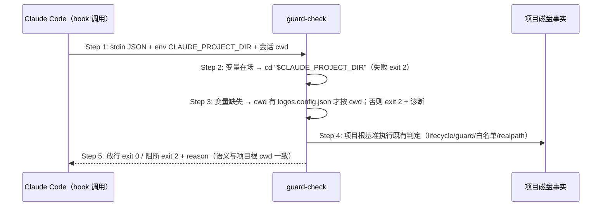

## ADDED — S09 guard-check 工作目录收敛与 fail-closed 时序

### 场景目标

`guard-check` 在任意会话 cwd 下都以**项目根**为判定基准：`CLAUDE_PROJECT_DIR` 在场即收敛到该目录；缺失且 cwd 非项目根时 fail-closed（exit 2 + 可读诊断），绝不静默放行。收敛后既有判定语义（lifecycle/guard 文件/白名单/realpath 归一化/exit 2 阻断合同）逐项不变。

### 参与者

- **Claude Code**：以会话 cwd + `CLAUDE_PROJECT_DIR` 环境变量执行 PreToolUse hook。
- **guard-check 脚本**：工作目录收敛 + 既有 guard 判定。
- **项目磁盘事实**：`logos/logos.config.json`、`logos/logos-project.yaml`、`logos/.openlogos-guard`。

### 前置条件

hook 已按 `$CLAUDE_PROJECT_DIR` 形态注册（S01/S08）。

### 成功后置条件

子目录 cwd 会话：无提案改码被阻断（exit 2 + reason），有提案在范围内放行——与项目根 cwd 判定逐项一致。

### 时序图

### 步骤说明

1. **Claude Code** 从任意 cwd 触发 Edit/Write/Bash 前置 hook。
2. **guard-check** 读取 stdin 后立即收敛工作目录：`cd "$CLAUDE_PROJECT_DIR"`，`cd` 失败输出 reason 并 exit 2。
3. 变量缺失（旧版 Claude Code 兼容窗口）：仅当 cwd 存在 `logos/logos.config.json` 按 cwd 判定；否则 fail-closed——「不知道项目根在哪」不得落入「非 OpenLogos 项目放行」分支。
4. 收敛后既有判定零改动：Edit/Write 的绝对 `file_path` realpath 归一化在项目根基准下语义自洽。
5. 阻断输出既有四要素 reason 结构不变。

### 异常与边界

#### EX-52.1：CLAUDE_PROJECT_DIR 指向不可进入目录
- **触发条件**：变量在场但目录不存在/无权限。
- **期望响应**：exit 2 + 可读诊断（fail-closed）。
- **副作用**：无。

#### EX-52.2：变量缺失且 cwd 为项目根
- **触发条件**：旧版 Claude Code、根目录会话。
- **期望响应**：按 cwd 判定，行为与 0.14.20 一致（兼容不回归）。
- **副作用**：无。

#### EX-52.3：变量缺失且 cwd 为项目子目录
- **触发条件**：旧版 Claude Code、`cd src/` 后会话。
- **期望响应**：exit 2 + 诊断（0.14.20 在此静默 exit 0——本案消除该 fail-open）。
- **副作用**：无提案改码不再被放行。

#### EX-52.4：真非 OpenLogos 项目
- **触发条件**：变量指向的项目根（或 cwd 根）确无 `logos/logos.config.json`。
- **期望响应**：`exit 0` 放行（既有语义保持——该分支要求「已确认项目根」这一前提）。
- **副作用**：无。

### 追溯

- 需求：Claude guard hook 项目根定位与 sync 补齐需求「guard-check 工作目录收敛要求」。
- 测试：UT-S09-313～314、ST-S09-120。
