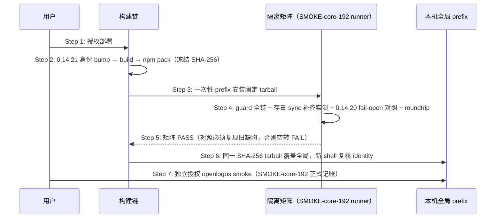

## ADDED — OpenLogos 0.14.21 guard 修复候选发布时序

### 场景目标

把已入仓的 guard hook 三项修复冻结为唯一 `0.14.21` tarball，经隔离矩阵（含 guard 全链、存量项目 sync 补齐实测与 0.14.20 fail-open 对照）与回滚演练后覆盖本机全局，并以 SMOKE-core-192 完成正式 smoke。

### 参与者

- **用户**：部署与 smoke 两个独立确认点的授权者。
- **OpenLogos CLI 构建链**：身份 bump、build、npm pack。
- **隔离 prefix / SMOKE-core-192 runner**：安装态验收执行者。
- **本机全局 prefix**：部署目标。

### 前置条件

guard 修复已合并入仓且 `openlogos verify` PASS（fix-claude-guard-hook-project-dir-and-sync-deploy 已归档）。

### 成功后置条件

全局 `openlogos --version` 精确 `0.14.21`，identity 全同源；SMOKE-core-192 pass、`SMOKE_PASS` 在场；存量项目可经 `openlogos sync` 补齐硬闸。

### 时序图

### 步骤说明

1. **用户** 明确授权部署（与 smoke 分离的两个确认点）。
2. **构建链** 同步候选身份全链并真实 `npm pack`，任何重新 pack 产生新 candidate identity。
3. **runner** 在 `mktemp -d` 一次性 prefix 从绝对入口执行，杜绝 workspace link。
4. **矩阵** 四类核心断言：init 新项目 hook `$CLAUDE_PROJECT_DIR` 形态与子目录 cwd 拦截/放行；变量缺失且 cwd 非根 fail-closed；存量项目（无 guard-check/仅旧 SessionStart）sync 后硬闸齐备且旧条目迁移、重复 sync 幂等；`0.14.20→0.14.21` roundtrip。
5. **对照**：固定 0.14.20 上同一子目录 cwd 无提案改码必须静默放行（缺陷复现）。
6. **全局覆盖** 后 identity 复核全同源 0.14.21。
7. **smoke** 独立授权，写唯一 SMOKE-core-192 记录。

### 异常与边界

#### EX-53.1：隔离矩阵失败
- **触发条件**：任一矩阵断言红。
- **期望响应**：停止部署、回实现、重新 verify/build/pack；不得为过矩阵伪造 settings/guard 产物。
- **副作用**：全局不受影响。

#### EX-53.2：对照空转
- **触发条件**：0.14.20 上子目录 cwd 场景也被拦截。
- **期望响应**：判 FAIL 并重写矩阵，而非放行部署。
- **副作用**：无。

#### EX-53.3：全局覆盖后行为异常
- **触发条件**：identity 漂移或 guard 行为异常。
- **期望响应**：按固定 0.14.20 tarball 回滚并复核 identity 全回 0.14.20。
- **副作用**：回滚留痕于部署报告。

### 追溯

- 需求：OpenLogos 0.14.21 guard 修复候选发布需求。
- 测试：UT-S19-38、SMOKE-core-192。
