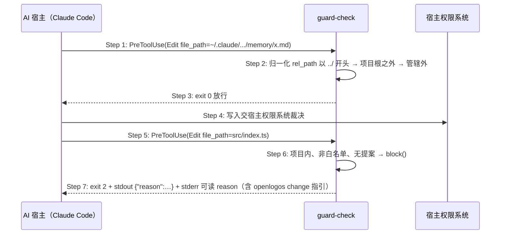

# Delta: core-S09-change-lifecycle.md（fix-guard-check-external-path-and-stderr）

## ADDED — S09 guard-check 管辖边界与阻断输出双通道时序

### 场景目标

guard-check 在 launched 无提案的拦截判定中，先按管辖边界放行项目根之外的目标（交宿主权限系统），再对项目根之内的越界写入以双通道（stdout JSON + stderr 可读文本）输出阻断原因，确保用户与 AI 宿主都能看到「先创建变更提案」的可操作指引。

### 参与者

- **AI 宿主（Claude Code）**：发起 Edit/Write/Bash 工具调用，exit 2 时从 stderr 读取拦截原因。
- **guard-check 脚本**：PreToolUse 决策器，管辖边界与白名单判定、双通道阻断输出。
- **宿主权限系统**：项目根之外写入的实际裁决者（guard 放行后接管）。

### 前置条件

项目 launched、无活跃提案（`logos/.openlogos-guard` 不存在）；hook 以 `$CLAUDE_PROJECT_DIR` 形态注册，Step 0 工作目录已收敛到项目根。

### 成功后置条件

项目根之外的写入未被 guard 拦截（由宿主权限系统继续判定）；项目根之内的越界写入被拦截且 stderr 含变更管理指引、stdout JSON 结构不变。

### 时序图

### 步骤说明

1. **AI 宿主** 对项目根之外的目标（如用户级 `~/.claude` 记忆文件）发起写入，PreToolUse 触发 guard-check。
2. **guard-check** 在白名单前缀匹配之前先判管辖：python3/node 归一化后 `rel_path` 为 `..` 或以 `../` 开头（bash 兜底分支：绝对路径不在 `$(pwd)/` 之下）→ 项目根之外。
3. **guard-check** 直接 exit 0 放行——guard 只保护本项目源码的变更可追溯性。
4. **宿主权限系统** 对该写入继续其自身权限判定（guard 不越权代管）。
5. **AI 宿主** 对项目根之内源码发起写入，PreToolUse 再次触发 guard-check。
6. **guard-check** 判定目标在项目内、不在白名单且无活跃提案，进入 `block()`。
7. **guard-check** 双通道输出后 exit 2：stdout 保留 `{"reason":"..."}` JSON（旧协议兼容），stderr 输出同一 reason 的可读文本（Claude Code 实际展示通道），指引先运行 `openlogos change <slug>`。

### 异常与边界

#### EX-56.1：Step 0 fail-closed 的 stderr 可见性
- **触发条件**：`CLAUDE_PROJECT_DIR` 指向不可进入目录，或变量缺失且 cwd 非项目根。
- **期望响应**：exit 2，stdout JSON 与 stderr 诊断**同时**输出；不得出现 stderr 为空的阻断。
- **副作用**：无。

#### EX-56.2：python3/node 均不可用的 bash 兜底
- **触发条件**：宿主环境缺 python3 与 node，归一化走 bash 前缀剥离。
- **期望响应**：绝对路径不在 `$(pwd)/` 之下 → 放行；在项目内则按剥离后的相对路径继续白名单判定，行为与归一化路径一致。
- **副作用**：无。

#### EX-56.3：项目外目标出现在 Bash 重定向
- **触发条件**：Bash 命令命中写入模式且重定向目标位于项目根之外。
- **期望响应**：`is_whitelisted_path` 对该目标按管辖边界放行（exit 0），与 Edit/Write 判定一致。
- **副作用**：无。

### 追溯

- 需求：Claude guard hook 管辖边界与阻断可见性需求。
- 测试：UT-S09-315、UT-S09-316、ST-S09-121。
