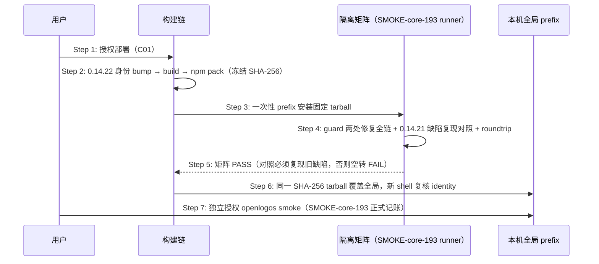

# Delta: core-S19-smoke-gate.md（fix-guard-check-external-path-and-stderr）

## ADDED — OpenLogos 0.14.22 guard 修复候选发布时序

### 场景目标

把 guard-check 两处修复（管辖边界、阻断 stderr 可见性）冻结为唯一 `0.14.22` tarball，经隔离矩阵（含两处修复全链与 0.14.21 缺陷复现对照）与回滚演练后覆盖本机全局，并以 SMOKE-core-193 完成正式 smoke。

### 参与者

- **用户**：部署与 smoke 两个独立确认点的授权者。
- **OpenLogos CLI 构建链**：身份 bump、build、npm pack。
- **隔离 prefix / SMOKE-core-193 runner**：安装态验收执行者。
- **本机全局 prefix**：部署目标。

### 前置条件

两处修复已合并入仓且 `openlogos verify` PASS（提案 fix-guard-check-external-path-and-stderr 代码切片完成）。

### 成功后置条件

全局 `openlogos --version` 精确 `0.14.22`，identity 全同源；SMOKE-core-193 pass、`SMOKE_PASS` 在场；存量项目可经 `openlogos sync` 刷新 guard-check 字节（runlogos 本地热修转正）。

### 时序图

### 步骤说明

1. **用户** 明确授权部署（与 smoke 分离的两个确认点；C01 用户决策原文「请帮我本机全局部署，升级到 0.14.22」）。
2. **构建链** 同步候选身份全链（`LOCAL_RELEASE_CANDIDATE_VERSION=0.14.22`、`ROLLBACK=0.14.21`）并真实 `npm pack`，任何重新 pack 产生新 candidate identity。
3. **runner** 在 `mktemp -d` 一次性 prefix 从绝对入口执行，杜绝 workspace link。
4. **矩阵** 三类核心断言：launched 无提案时写项目根之外路径（`~/.claude` 形态与其他仓库绝对路径）放行 exit 0；写项目内源码拦截 exit 2 且 stderr 含变更管理指引、stdout JSON 结构不变（Step 0 fail-closed 同验 stderr）；`0.14.21→0.14.22` roundtrip 无混装。
5. **对照**：固定 0.14.21 上同场景必须复现项目外**误拦截**与拦截时 **stderr 为空**（缺陷复现，防断言空转）。
6. **全局覆盖** 后 identity 复核全同源 0.14.22。
7. **smoke** 独立授权，写唯一 SMOKE-core-193 记录。

### 异常与边界

#### EX-57.1：隔离矩阵失败
- **触发条件**：任一矩阵断言红。
- **期望响应**：停止部署、回实现、重新 verify/build/pack；不得为过矩阵伪造 guard 输出或跳过对照。
- **副作用**：全局不受影响。

#### EX-57.2：对照空转
- **触发条件**：0.14.21 上项目外场景也放行、或拦截时 stderr 也非空。
- **期望响应**：判 FAIL 并重写矩阵，而非放行部署。
- **副作用**：无。

#### EX-57.3：全局覆盖后行为异常
- **触发条件**：identity 漂移或 guard 行为异常。
- **期望响应**：按固定 0.14.21 tarball（sha256 `ac173f5f…c285f`）回滚并复核 identity 全回 0.14.21。
- **副作用**：回滚留痕于部署报告。

### 追溯

- 需求：OpenLogos 0.14.22 guard 修复候选发布需求。
- 测试：UT-S19-39、SMOKE-core-193。
