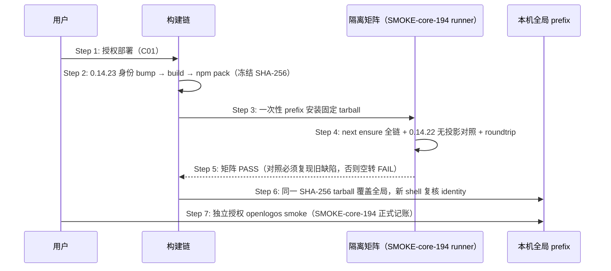

# Delta: core-S19-smoke-gate.md（fix-next-ensure-initial-plan-slice-transaction）

## ADDED — OpenLogos 0.14.23 next 问即建候选发布时序

### 场景目标

把 next 问即建修复（initial-plan 事务 ensure + `slice_transaction` 投影输出）冻结为唯一 `0.14.23` tarball，经隔离矩阵（含 ensure 全链与 0.14.22 无投影缺陷复现对照）与回滚演练后覆盖本机全局，并以 SMOKE-core-194 完成正式 smoke。

### 参与者

- **用户**：部署与 smoke 两个独立确认点的授权者。
- **OpenLogos CLI 构建链**：身份 bump、build、npm pack。
- **隔离 prefix / SMOKE-core-194 runner**：安装态验收执行者。
- **本机全局 prefix**：部署目标。

### 前置条件

问即建修复已合并入仓且 `openlogos verify` PASS（提案 fix-next-ensure-initial-plan-slice-transaction 代码切片完成）。

### 成功后置条件

全局 `openlogos --version` 精确 `0.14.23`，identity 全同源；SMOKE-core-194 pass、`SMOKE_PASS` 在场；runlogos 全自动链路经全局 CLI 刷新后新提案首达 plan-slices 不再死锁。

### 时序图

### 步骤说明

1. **用户** 明确授权部署（与 smoke 分离的两个确认点；C01 用户决策「捆绑发布 0.14.23 + 全局部署 + smoke」）。
2. **构建链** 同步候选身份全链（`LOCAL_RELEASE_CANDIDATE_VERSION=0.14.23`、`ROLLBACK=0.14.22`）并真实 `npm pack`，任何重新 pack 产生新 candidate identity。
3. **runner** 在 `mktemp -d` 一次性 prefix 从绝对入口执行，杜绝 workspace link。
4. **矩阵** 核心断言：安装态构造 ready-to-implement 提案（spec-complete、`[code]` 标题在场切片未填）→ `next --format json` 携带 `slice_transaction` 投影（`origin=initial-plan`、`content_slots.required=2`）且 `TEST_SLICE_TRANSACTION.json` 落盘 → 重跑 `next` 幂等（`transaction_id` 不变）→ `submit-content` 续用同一事务不重建；`0.14.22→0.14.23` roundtrip 无混装。
5. **对照**：固定 0.14.22 上同场景必须复现 `next` 输出**无 `slice_transaction` 字段**且事务文件**不落盘**（缺陷复现，防断言空转）。
6. **全局覆盖** 后 identity 复核全同源 0.14.23。
7. **smoke** 独立授权，写唯一 SMOKE-core-194 记录。

### 异常与边界

#### EX-60.1：隔离矩阵失败
- **触发条件**：任一矩阵断言红。
- **期望响应**：停止部署、回实现、重新 verify/build/pack；不得为过矩阵伪造 next 输出或跳过对照。
- **副作用**：全局不受影响。

#### EX-60.2：对照空转
- **触发条件**：0.14.22 上同场景 `next` 也输出投影或事务文件也落盘。
- **期望响应**：判 FAIL 并重写矩阵，而非放行部署。
- **副作用**：无。

#### EX-60.3：全局覆盖后行为异常
- **触发条件**：identity 漂移或 next ensure 行为异常。
- **期望响应**：按固定 0.14.22 tarball（sha256 `0bdcefb3…83ac1`）回滚并复核 identity 全回 0.14.22。
- **副作用**：回滚留痕于部署报告。
