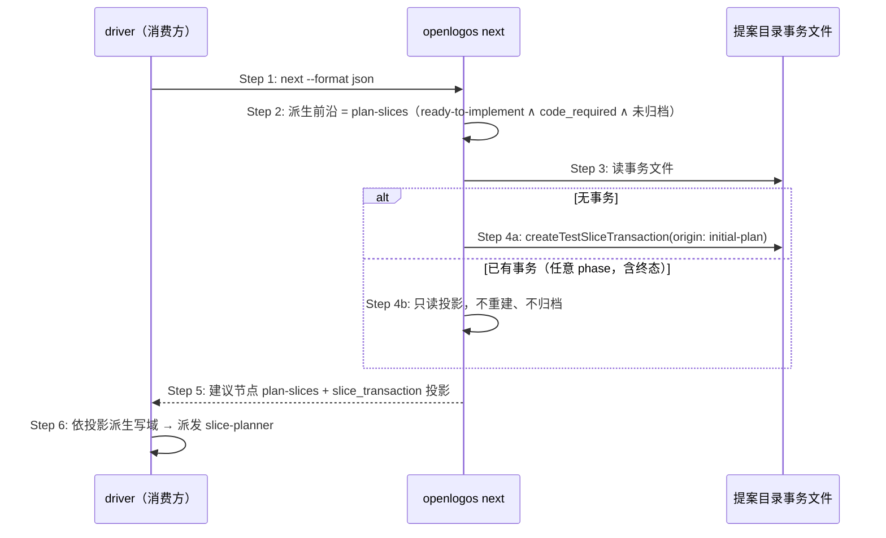

# Delta: core-S28-next-node.md（fix-next-ensure-initial-plan-slice-transaction）

## ADDED — S28 initial-plan 事务的问即建与投影输出

### 场景目标

`next` 在模块前沿为 `plan-slices`（ready-to-implement、需要代码、切片未填、提案未归档）时，ensure initial-plan 切片事务并在输出中携带 canonical 投影——发证时机与消费方投影前置契约对齐，消除「投影只有 submit-content 后才存在、driver 没投影又拒绝派发 slice-planner」的鸡生蛋死锁。与 manifest-recovery 分支同层、同构（先例：「恢复的执行权归 OpenLogos——此处创建或返回事务投影，而非仅返回一个建议节点」）。

### 参与者

- **消费方 driver**（如 runlogos）：只读 `next` 输出，按 `slice_transaction` 投影派生写域后派发 slice-planner。
- **OpenLogos `next`**：ensure 执行者与投影输出者（事务唯一 writer）。
- **提案目录**：`TEST_SLICE_TRANSACTION.json` 落盘位置。

### 前置条件

活跃提案 spec-complete（`SPEC_MERGED` 在场）、`[code]` 标题在场且切片未填、提案未归档。

### 成功后置条件

`next --format json` 的模块项建议节点为 `plan-slices` 且携带 `slice_transaction` 投影（首达时 `origin=initial-plan`、`phase=collecting`、`content_slots.required=2`）；`TEST_SLICE_TRANSACTION.json` 在盘；重复执行幂等。

### 时序图

### 步骤说明

1. 消费方在派发 slice-planner 前调用 `next`（其契约：投影缺失即 fail-closed，不自行推导写域）。
2. ensure 触发条件全部满足才进入 Step 3；非 plan-slices 前沿（writing / delta-writing / ready-to-merge / coding / verify 各步）、无 `[code]` 标题、无活跃提案、initial 生命周期一律不创建、不输出该字段。
3. ~ 4. 无事务则创建（`origin=initial-plan`）；已有事务（含 `completed` / `failed` 终态）只读投影输出——ensure 不触发终态归档让位（那是新一轮 `createTestSliceTransaction` 的行为）。
5. 投影 schema 沿用 `openlogos/test-slice-transaction@1`（与 manifest-recovery 分支同一字段表，仅扩大出现场景）。
6. 消费方零改动痊愈：其消费处本就在找 `slice_transaction` 字段。

### 异常与边界

#### EX-58.1：事务创建失败
- **触发条件**：Step 4a IO 异常等导致创建失败。
- **期望响应**：如实反映为「无投影」——输出不含 `slice_transaction` 字段、detail 携带错误信息；不降级为仅建议节点（消费方 fail-closed，不误以为可自行恢复）。
- **副作用**：无半写事务文件。

#### EX-58.2：与 manifest-recovery 分支的互斥
- **触发条件**：`deriveSliceVerificationState()` 判定 manifest 失效态（missing / invalid / stale）。
- **期望响应**：走既有 recovery 分支（`origin=manifest-recovery`、required 收窄），本 ensure 不介入；两分支不并发创建、不互相覆盖。
- **副作用**：无。

#### EX-58.3：幂等重入
- **触发条件**：同一状态下重复执行 `next`（含 `--auto` 与只读并发）。
- **期望响应**：不重复创建；投影 `transaction_id` 稳定不变；除事务文件外 `next` 不产生任何其它写副作用。
- **副作用**：无。

### 追溯

- 功能规格：§2.65（ensure 语义、行为表、失败口径、与 recovery / 用即建关系）。
- 根规范：`spec/cli-json-output.md`（next 输出携带 `slice_transaction` 的字段口径）、`spec/test-slice-manifest.md`（创建时机合同）。
- 测试：UT-S28-50～52、ST-S28-16。
