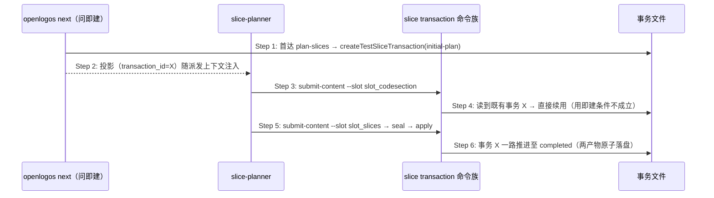

# Delta: core-S32-slice-planning.md（fix-next-ensure-initial-plan-slice-transaction）

## ADDED — S32 initial-plan 事务创建时机前移（next 问即建，submit-content 用即建降为幂等兜底）

### 场景目标

initial-plan 切片事务的创建时机从「首次 `submit-content` 用即建」前移为「`next` 首达 plan-slices 问即建」；用即建保留为幂等兜底，手动流程零回归。消费方（driver）由此在派发 slice-planner 之前就拿到 canonical 投影派生写域，slice-planner 的 `submit-content` 续用同一事务。

### 参与者

- **OpenLogos `next`**：问即建执行者（见 S28 ensure 时序）。
- **slice-planner**：内容生产者，经 `submit-content` 向 slot 提交内容。
- **`openlogos slice transaction` 命令族**：事务推进入口。

### 前置条件

提案 spec-complete、`[code]` 标题在场且切片未填。

### 成功后置条件

同一提案自始至终只有一个 initial-plan 事务：`next` 已建 → `submit-content` 直接续用（不重建、不冲突）；无 `next` 前置的手动路径 → `submit-content` 仍按需创建（懒创建零回归）。

### 时序图

### 步骤说明

1. 问即建触发条件与行为表见 S28 ensure 时序与功能规格 §2.65.2。
2. 投影经消费方注入 slice-planner 上下文；手动流程可跳过本步。
3. ~ 4. `submit-content` 的用即建判定不变（「无事务才创建」）；`next` 已建时该条件不成立，直接续用——**不重建、不产生第二事务**。
5. ~ 6. seal 校验、apply 原子写出与终态守门逐项沿用既有合同（§2.53），本变更零触碰。

### 异常与边界

#### EX-59.1：手动流程无 next 前置
- **触发条件**：人工直接跑 slice-planner，`submit-content` 时无事务在盘。
- **期望响应**：用即建照旧创建 initial-plan 事务并继续——懒创建路径零回归。
- **副作用**：无。

#### EX-59.2：终态事务在场时的问即建
- **触发条件**：前一轮事务已 `completed`（如切片已规划待 slice-exit），`next` 再次执行。
- **期望响应**：只读输出该终态投影，不重建、不归档；受控重划仍走既有 `reopen` 通道（§2.56），问即建不成为第二条重划入口。
- **副作用**：无。

### 追溯

- 功能规格：§2.65.2 / §2.65.3；场景：S28 ensure 时序。
- 根规范：`spec/test-slice-manifest.md`（创建时机合同）。
- 测试：UT-S32-71～72。
