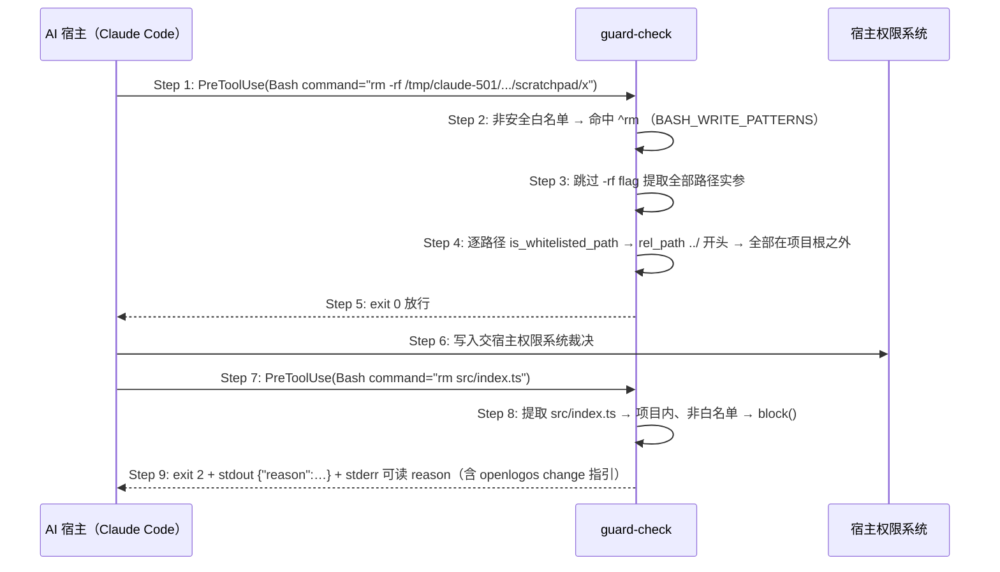

# Delta: core-S09-change-lifecycle.md

> change: fix-guard-check-bash-write-target-jurisdiction
> 目标：`logos/resources/prd/3-technical-plan/2-scenario-implementation/core-S09-change-lifecycle.md`

## ADDED — S09 guard-check Bash 写命令路径提取与逐路径管辖判定时序

### 场景目标

guard-check 在 launched 无提案的 Bash 写命令判定中，对命中 `BASH_WRITE_PATTERNS` 的 `rm`/`cp`/`mv`/`mkdir`/`touch`/`chmod`/`chown` 类命令先提取全部路径实参，再逐路径走既有 `is_whitelisted_path` 管辖判定：全部路径在项目根之外或白名单内则放行（交宿主权限系统），任一路径在项目内且非白名单维持拦截；解析不出的复杂形态维持现行无条件拦截（fail-closed 保守臂）。

### 参与者

- **AI 宿主（Claude Code）**：发起 Bash 工具调用（如写 session scratchpad 的 `rm`/`cp`）。
- **guard-check 脚本**：PreToolUse 决策器——安全白名单 → 写模式匹配 → 路径提取 → 逐路径管辖判定。
- **宿主权限系统**：项目根之外写入的实际裁决者（guard 放行后接管）。

### 前置条件

项目 launched、无活跃提案（`logos/.openlogos-guard` 不存在）；hook 以 `$CLAUDE_PROJECT_DIR` 形态注册，Step 0 工作目录已收敛到项目根。

### 成功后置条件

全部路径实参在项目根之外（或白名单内）的 Bash 写命令未被 guard 拦截；任一路径在项目内非白名单的命令被拦截且 stderr 含变更管理指引；解析不出的命令维持现行拦截。

### 时序图

### 步骤说明

1. **AI 宿主** 对项目根之外的目标（如 session scratchpad）发起 `rm -rf` 命令，PreToolUse 触发 guard-check。
2. **guard-check** 先过 `BASH_SAFE_PATTERNS`（不命中），再匹配 `BASH_WRITE_PATTERNS` 命中 `^rm `。
3. **guard-check** 跳过以 `-` 开头的选项 flag，提取命令的全部路径实参（`rm`/`mkdir`/`touch`/`chmod`/`chown` 全量实参；`cp`/`mv` 全量实参含源与目标）；既有 `>`/`>>` 重定向目标提取保持不变。
4. **guard-check** 对每个路径逐一走既有 `is_whitelisted_path`（含 0.14.22 管辖边界与白名单判定）——本例全部路径归一化后在项目根之外。
5. **guard-check** exit 0 放行——guard 只保护本项目源码的变更可追溯性。
6. **宿主权限系统** 对该写入继续其自身权限判定。
7. **AI 宿主** 对项目根之内源码发起 `rm`，PreToolUse 再次触发 guard-check。
8. **guard-check** 提取出的路径落在项目内且非白名单，进入 `block()`——任一路径命中即拦截，不因其余路径在外而放行。
9. **guard-check** 双通道输出后 exit 2（stdout JSON + stderr 可读指引，合同与 0.14.22 一致）。

### 异常与边界

#### EX-61.1：解析不出的复杂形态维持拦截（保守臂）
- **触发条件**：命中写模式的命令含变量展开（`$VAR`）、命令替换（`$(…)`/反引号）、管道或复合形态（`|`、`&&`、`;`），无法确定全部路径实参。
- **期望响应**：维持现行无条件拦截（exit 2），fail-closed 不放宽；不尝试部分提取后放行。
- **副作用**：无。

#### EX-61.2：混合路径命令任一在内即拦截
- **触发条件**：`cp <项目外源> <项目内非白名单目标>` 或 `mv <项目内源> <项目外目标>` 等混合形态。
- **期望响应**：逐路径判定中任一路径在项目根之内且非白名单 → exit 2 拦截（携 stderr 指引）；不得因存在项目外路径而放行。
- **副作用**：无。

#### EX-61.3：安全白名单优先级不变
- **触发条件**：命令同时可匹配 `BASH_SAFE_PATTERNS`（如 `git push`）。
- **期望响应**：安全白名单先判、直接放行，不进入写模式与路径提取分支——与现行顺序一致。
- **副作用**：无。

#### EX-61.4：三运行时同判
- **触发条件**：宿主环境分别为 python3 可用、仅 node 可用、python3/node 均不可用（bash 兜底）。
- **期望响应**：同一命令在三条判定路径下放行/拦截结论一致；bash 兜底分支对绝对路径按 `$(pwd)/` 前缀判管辖，与归一化路径结论一致。
- **副作用**：无。

### 追溯

- 需求：guard-check Bash 写命令路径级管辖判定需求。
- 测试：UT-S09-317、UT-S09-318、ST-S09-122。
