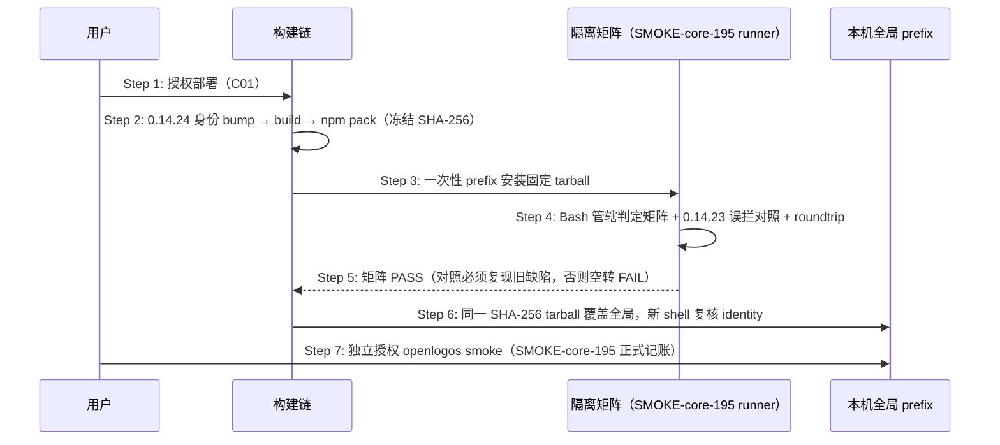

# Delta: core-S19-smoke-gate.md

> change: fix-guard-check-bash-write-target-jurisdiction
> 目标：`logos/resources/prd/3-technical-plan/2-scenario-implementation/core-S19-smoke-gate.md`

## ADDED — OpenLogos 0.14.24 guard Bash 管辖判定候选发布时序

### 场景目标

把 guard-check Bash 写命令路径提取与逐路径管辖判定修复冻结为唯一 `0.14.24` tarball，经隔离矩阵（含全外路径放行/项目内拦截矩阵与 0.14.23 误拦缺陷复现对照）与回滚演练后覆盖本机全局，并以 SMOKE-core-195 完成正式 smoke。

### 参与者

- **用户**：部署与 smoke 两个独立确认点的授权者。
- **OpenLogos CLI 构建链**：身份 bump、build、npm pack。
- **隔离 prefix / SMOKE-core-195 runner**：安装态验收执行者。
- **本机全局 prefix**：部署目标。

### 前置条件

Bash 写命令路径提取与逐路径管辖判定修复已合并入仓且 `openlogos verify` PASS（提案 fix-guard-check-bash-write-target-jurisdiction 代码切片完成）。

### 成功后置条件

全局 `openlogos --version` 精确 `0.14.24`，identity 全同源；SMOKE-core-195 pass、`SMOKE_PASS` 在场；存量项目经 `openlogos sync` 刷新 guard-check 字节后，无提案期项目外 `rm`/`cp` 等写命令不再被误拦。

### 时序图

### 步骤说明

1. **用户** 明确授权部署（与 smoke 分离的两个确认点；C01 用户决策「捆绑 0.14.24 + 全局部署 + smoke」）。
2. **构建链** 同步候选身份全链（`LOCAL_RELEASE_CANDIDATE_VERSION=0.14.24`、`ROLLBACK=0.14.23`）并真实 `npm pack`，任何重新 pack 产生新 candidate identity。
3. **runner** 在 `mktemp -d` 一次性 prefix 从绝对入口执行，杜绝 workspace link。
4. **矩阵** 核心断言：安装态 launched 无提案项目下驱动随包 guard-check——全外路径 `rm -rf`/`cp <外→外>` → exit 0 放行；任一项目内非白名单路径（含混合形态 `cp <外> <内>`）→ exit 2 且 stderr 含指引、stdout JSON 结构不变；解析不出形态（变量展开/命令替换/管道复合）→ exit 2 维持拦截；项目内白名单/安全白名单/重定向判定零回归；`0.14.23→0.14.24` roundtrip 无混装。
5. **对照**：固定 0.14.23 上同一全外路径 `rm`/`cp` 场景必须复现 **exit 2 误拦截**（缺陷复现，防断言空转）。
6. **全局覆盖** 后 identity 复核全同源 0.14.24。
7. **smoke** 独立授权，写唯一 SMOKE-core-195 记录。

### 异常与边界

#### EX-62.1：隔离矩阵失败
- **触发条件**：任一矩阵断言红。
- **期望响应**：停止部署、回实现、重新 verify/build/pack；不得为过矩阵伪造 guard 输出或跳过对照。
- **副作用**：全局不受影响。

#### EX-62.2：对照空转
- **触发条件**：0.14.23 上同一全外路径写命令也放行（exit 0）。
- **期望响应**：判 FAIL 并重写矩阵，而非放行部署。
- **副作用**：无。

#### EX-62.3：全局覆盖后行为异常
- **触发条件**：identity 漂移或 guard 判定行为异常（误拦复发或安全面放宽）。
- **期望响应**：按固定 0.14.23 tarball（sha256 `de042d28…07a5b`）回滚并复核 identity 全回 0.14.23。
- **副作用**：回滚留痕于部署报告。

### 追溯

- 需求：OpenLogos 0.14.24 候选发布需求。
- 测试：UT-S19-41；smoke：SMOKE-core-195。
